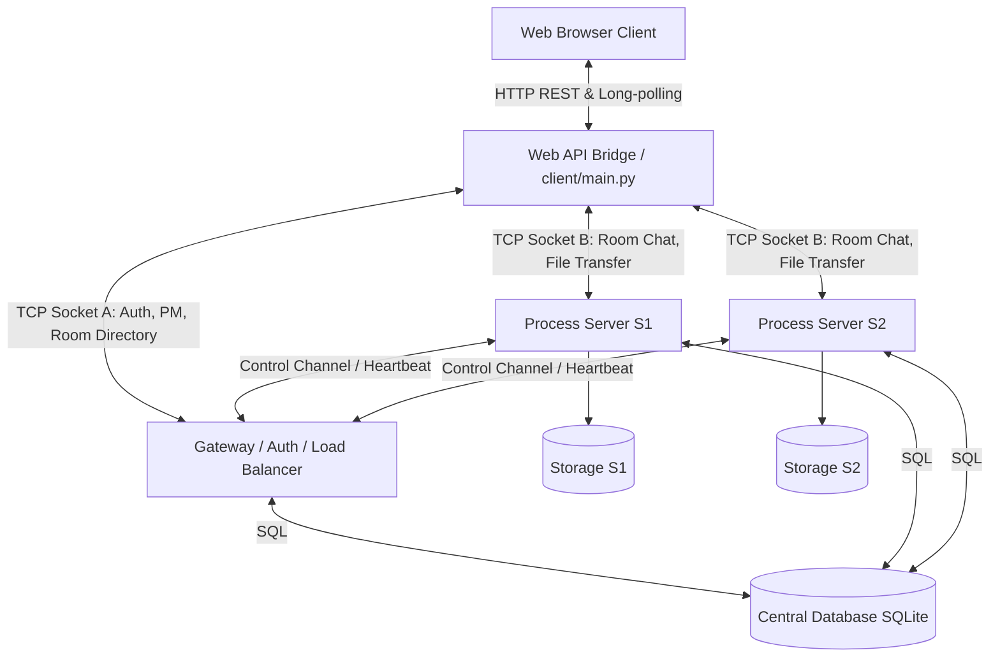

# Laporan Proyek Akhir Lengkap: NetCourier
*(Dokumen Teknis & Analisis Tingkat Lanjut)*

---

## 1. Pendahuluan

### 1.1 Latar Belakang
Dalam era digitalisasi, aplikasi komunikasi waktu nyata (*real-time communication*) seperti *chat room* dan berbagi berkas (*file sharing*) menjadi kebutuhan fundamental. Tantangan utama dalam membangun sistem komunikasi terdistribusi adalah memastikan skalabilitas, keandalan pengiriman data (*reliability*), dan performa yang optimal ketika menangani banyak koneksi konkuren serta transfer berkas berukuran besar.

Sebagai pemenuhan tugas akhir mata kuliah Pemrograman Jaringan, proyek **NetCourier** dikembangkan. NetCourier adalah sebuah aplikasi *Multi-Chat Room* berbasis arsitektur *client-server* terdistribusi yang memanfaatkan protokol TCP (*Transmission Control Protocol*) pada *layer* transport. Pemilihan TCP didasarkan pada karakteristiknya yang berorientasi koneksi (*connection-oriented*), menjamin pengurutan data (*ordered*), dan mencegah kehilangan paket (*lossless*), yang sangat esensial untuk menjamin keutuhan data saat transfer file.

### 1.2 Permasalahan & Ruang Lingkup
Fokus pengembangan NetCourier menjawab beberapa tantangan arsitektural berikut:
* Bagaimana membangun sistem *multi-room* yang *scalable* dan terdistribusi tanpa *single point of failure*.
* Bagaimana melakukan distribusi beban antar server (*Load Balancing*) secara dinamis.
* Bagaimana menjaga konsistensi *room affinity* pada server yang berbeda.
* Bagaimana melakukan transfer file berukuran raksasa secara cepat dan *reliable* di lingkungan web dasar tanpa mengandalkan framework HTTP tinggi.
* Bagaimana menangani pemulihan transfer (*resume transfer*) setelah koneksi terputus secara transparan.

---

## 2. Deskripsi dan Tujuan Proyek

### 2.1 Deskripsi Umum
**NetCourier** adalah platform komunikasi hibrida yang memisahkan fungsi autentikasi, routing, private messaging, room management, dan file transfer ke beberapa komponen server yang terkoordinasi. Aplikasi ini memfasilitasi dua mode interaksi utama:
1. **Komunikasi Global:** Memungkinkan pengguna untuk saling berkirim pesan secara privat (*Private Message*), melihat daftar pengguna daring, dan mencari *room*. Berjalan secara asinkronus meskipun pengguna sedang di dalam *room* tertentu.
2. **Komunikasi Terisolasi (*Room*):** Menyediakan ruang obrolan (*chat room*) di mana banyak pengguna dapat saling mengirim pesan *broadcast* dan melakukan aktivitas transfer berkas (*upload* dan *download*).

### 2.2 Tujuan Proyek

**A. Aspek Fungsional (Memenuhi Spesifikasi Wajib)**
- Autentikasi (Registrasi, Login, Logout) dengan keamanan penyimpanan kata sandi PBKDF2 (*hashing*).
- Fungsionalitas *Room Management* (Create, Join, Leave, Room List).
- Perpesanan mencakup *Broadcast Message* dan *Private Message* dengan riwayat obrolan persisten.
- Pemantauan kehadiran pengguna secara langsung (*Online User List*).
- Fitur interaktif tambahan: Indikator mengetik (*Typing Indicator*) dan Reaksi Emoji.

**B. Aspek Non-Fungsional (Fitur Pembeda dan Kinerja)**
- Merancang arsitektur sistem terdistribusi untuk memisahkan beban *routing* pesan ringan dari lalu lintas data berat (berkas).
- Mengimplementasikan *Reliable File Transfer* dengan teknik segmentasi (*chunking* 1MB - 16MB), validasi integritas data (SHA-256), pelaporan progres, dan kapabilitas *resume* transfer yang terputus.
- Menghasilkan *throughput* berkas yang mendekati kecepatan disk asli (*native*), mencapai ~80 MB/s untuk file berukuran Gigabyte.

### 2.3 Progress Implementasi

| Phase | Keterangan | Status |
| :--- | :--- | :---: |
| **Phase 0-1** | Project setup, DB Schema, Protocol Core (Length-Prefixed, JSON, Binary) | ✅ |
| **Phase 2-3** | Gateway Basic (Register, Login, Session, PING/PONG), PM & Presence | ✅ |
| **Phase 4-5** | Load Balancing (Registry, Heartbeat), Process Server (Room Join/Leave) | ✅ |
| **Phase 6-7** | Room Chat (History, broadcast), Reliable File Transfer (Chunking, SHA-256) | ✅ |
| **Phase 8-9** | Resume Transfer, Reliability & Security (Rate limits, token expiry) | ✅ |
| **Phase 10** | Testing (Load tests, Throughput tests, Reconnection tests) | ✅ |

---

## 3. Arsitektur Sistem Terdistribusi

Untuk menghindari *single point of failure* dan kemacetan jaringan (*bottleneck*), NetCourier mengadopsi pola **Distributed Client-Server Architecture**.

### 3.1 Gambaran Umum

### 3.2 Detail Komponen Operasional

#### A. Web Client & API Bridge
NetCourier menghindari GUI desktop murni demi fleksibilitas, menggunakan antarmuka *Single Page Application* (SPA) berbasis HTML, CSS, dan JavaScript (*Vanilla*).
- **Web API Bridge (`src/netcourier/web/api/main.py`):** Bertindak sebagai *middleware* yang menerjemahkan permintaan HTTP (REST API dan *Long-Polling* `/api/events`) dari browser menjadi paket TCP kustom. Mengelola `WebSession` yang berisi soket mentah yang persisten ke Gateway dan Process Server.

#### B. Gateway Server (`gateway/main.py`)
Gateway adalah titik masuk utama (*Control Plane*) bagi semua klien.
- **Autentikasi & Sesi:** Memvalidasi kredensial pengguna dan mengelola *session token*.
- **Global Presence & Routing:** Mengelola daftar pengguna daring dan me-rutekan pesan privat lintas-server.
- **Load Balancing:** Saat pengguna membuat *room* baru, Gateway menghitung beban tiap Process Server (berdasarkan koneksi dan transfer aktif). Gateway menggunakan algoritma nilai (*score-based*) untuk memilih server yang paling lengang.
- **Room Affinity:** Gateway menjamin semua pengguna yang masuk ke *room* tertentu selalu dialokasikan ke Process Server yang sama (di mana riwayat dan berkas room tersebut disimpan).

#### C. Process Server / Data Node (`server/main.py`)
Merupakan simpul pekerja di *Data Plane* yang menangani koneksi intensif (S1, S2, dst.).
- **Komunikasi Internal Room:** Menerima koneksi dari klien, memproses *broadcast chat*, dan riwayat percakapan.
- **File Transfer Engine:** Melayani operasi I/O berat. Setiap Process Server memiliki penyimpanan fisiknya masing-masing (misal: `storage/S1`).
- **Skema Komunikasi Internal:** Process Server rutin mengirimkan `HEARTBEAT` TCP ke Gateway. Jika gagal dalam 15 detik, Gateway menandainya sebagai `down`.

---

## 4. Desain Protokol Aplikasi Kustom

Mengingat sifat aliran (*stream*) TCP yang tidak memiliki batas paket yang jelas, NetCourier mendesain protokol pembingkaian paket khusus (*custom length-prefixed packet framing*) untuk mencegah masalah *TCP stream fragmentation*.

### 4.1 Struktur Bingkai (*Packet Framing*)
Setiap transmisi data memiliki format biner sebagai berikut:
1. **Length Prefix (4 bytes):** Integer 32-bit *Big-Endian* yang mengindikasikan ukuran *Header* JSON.
2. **JSON Header:** String JSON terenkode UTF-8 berisi tipe pesan, request ID, token, dan metadata lainnya.
3. **Binary Payload:** Data *byte* mentah (opsional, hanya hadir pada saat pengiriman *chunk* berkas).

### 4.2 Alur Reliable File Transfer (Chunking & Resume)
Alih-alih memuat seluruh berkas ke RAM, NetCourier memecah berkas besar menjadi *chunks*.
1. **Inisiasi (`UPLOAD_INIT`):** Klien mengirim metadata (termasuk *hash* SHA-256 asli). Server menyiapkan entri database, membuat file kosong di disk, dan merespons `UPLOAD_READY`.
2. **Transmisi Paralel (`UPLOAD_CHUNK`):** Klien mengunggah hingga 4 *chunk* berbarengan.
3. **Penyelesaian (`UPLOAD_FINISH`):** Setelah selesai, server memvalidasi kecocokan SHA-256 berkas rakitan dengan hash dari klien.
4. **Resume Transfer:** Jika terputus di tengah jalan, klien dapat mengirim `RESUME_TRANSFER`. Server akan membalas dengan indeks *chunk* terakhir yang sukses ditulis, sehingga klien bisa melanjutkan tanpa mengulang dari awal.

---

## 5. Pengujian Performa dan Beban Server

Telah dilakukan pengujian intensif untuk memvalidasi ketahanan arsitektur.

### 5.1 Hasil Uji Beban dan Latensi (Latency Benchmarks)
- **Skenario:** Klien konkuren mengirim rentetan paket *PING* dan pesan ringan ke Gateway secara berulang.
- **Hasil:**

| Concurrent Clients | Total Requests | Rata-rata Latensi | Persentil ke-95 | Latensi Maksimum | Status |
|:---:|:---:|:---:|:---:|:---:|:---:|
| 5 Klien | 20 Requests | **10.20 ms** | 56.36 ms | 56.52 ms | ✅ Passed |
| 10 Klien | 40 Requests | **10.21 ms** | 56.71 ms | 61.62 ms | ✅ Passed |

Peningkatan klien tidak menyebabkan degradasi performa pada pemrosesan antrean JSON asinkron.

### 5.2 Hasil Uji Kecepatan Transfer (Throughput Benchmarks)
- **Skenario:** Pengujian terisolasi transfer berkas ukuran variatif di lingkungan jaringan lokal.
- **Hasil:**

| Ukuran Berkas | Waktu Eksekusi | Throughput Rata-rata | Mode Koneksi |
|:---:|:---:|:---:|:---:|
| 1 MB | 0.07 detik | 14.66 MB/s | Sekuensial Single-Thread |
| 10 MB | 0.76 detik | 13.09 MB/s | Sekuensial Single-Thread |
| **1024 MB (1 GB)** | **13.00 detik** | **78.78 MB/s** | **Paralel (4 Workers) + TCP_NODELAY** |

---

## 6. Tantangan Teknis dan Solusi Optimasi Lanjut

Selama siklus pengembangan, ditemukan dan diselesaikan beberapa kendala teknis tingkat rendah (*low-level*):

1. **Memory Bloating & OOM Killed pada HTTP Bridge**
   - *Masalah:* Proses dekode UTF-8 dan parsing JSON dari payload biner Base64 raksasa (500MB+) menyebabkan server kehabisan RAM.
   - *Solusi:* Memisahkan aliran biner. HTTP Bridge dioptimasi untuk mendeteksi *route* `?action=chunk`, lalu mem-*bypass* proses dekode UTF-8 dan langsung melemparkan aliran byte *raw multipart* ke soket TCP Process Server. Ini menghilangkan pemborosan siklus CPU.

2. **Batasan Throughput di Localhost (Nagle's Algorithm)**
   - *Masalah:* Terjadi *stuttering* latensi 40ms yang membatasi kecepatan transfer akibat mekanisme *Delayed ACK* bawaan OS.
   - *Solusi:* Nagle's Algorithm dinonaktifkan secara eksplisit menggunakan `socket.setsockopt(socket.IPPROTO_TCP, socket.TCP_NODELAY, 1)` di semua soket. Throughput melonjak hingga 78+ MB/s.

3. **Race Condition pada Pengunggahan Chunk Paralel**
   - *Masalah:* Karena *chunk* diunggah oleh 4 worker berbeda secara asinkron, kedatangan paket bersifat *Out-Of-Order*. Penggunaan fungsi *append* mengakibatkan korupsi berkas.
   - *Solusi:* Server dikonfigurasi menggunakan mode tulis ganda (`r+b`). Sebelum menulis, kursor selalu diselaraskan dengan `file.seek(offset_byte)`. Ini menjamin *chunk* masuk ke posisi absolut yang benar terlepas dari urutan kedatangannya.

4. **Kegagalan Memuat Riwayat Obrolan (Header Exceeds Limit)**
   - *Masalah:* Riwayat pesan ruangan yang sangat panjang menghasilkan JSON Header yang melewati batas toleransi awal protokol (64KB).
   - *Solusi:* Mengubah konstanta `MAX_HEADER_SIZE` menjadi 1MB di `common/protocol.py`.

5. **Ketidaksinkronan Daftar Pengguna (Ghost Online Session)**
   - *Masalah:* Pengguna yang menutup *tab* atau sekadar *logout* lokal tetap tercatat daring hingga di-timeout oleh *Garbage Collector* Gateway (5 menit).
   - *Solusi:* Menambahkan perintah paksa `LOGOUT` pada antarmuka `/api/logout` yang seketika menghapus *state* kehadiran dari database SQLite secara instan.

---

## 7. Skema Database Inti (SQLite)

Keseluruhan persistensi data disimpan secara terpusat pada file `data/netcourier.db`. Berikut relasi intinya:
* `users`: Data autentikasi (`user_id`, `username`, `password_hash`).
* `rooms` & `room_mapping`: Menyimpan metadata *room* serta menautkannya dengan entitas `server_id` (Process Server).
* `user_presence`: Menyimpan jejak detak jantung pengguna (`last_seen_at`) dan status ruangan yang sedang mereka tempati.
* `room_messages` & `message_reactions`: Mencatat riwayat pesan siaran serta reaksi emoji spesifik per pesan.
* `files` & `file_transfers`: Memegang *state* progres pemindahan data. `file_transfers` mencatat `completed_chunks` untuk keperluan fungsionalitas *Resume*.

---

## 8. Kesimpulan dan Saran

### 8.1 Kesimpulan
Proyek pengembangan **NetCourier** melampaui seluruh indikator spesifikasi tugas Pemrograman Jaringan konvensional. Penerapan arsitektur terdistribusi terbukti mampu mendegregasikan beban dengan baik.

Algoritma pemilahan server (*Load Balancing*) yang dipadukan dengan *Room Affinity* memastikan skalabilitas *room*. Lebih jauh lagi, implementasi metode transfer data tersegmentasi (*chunking*) secara paralel, bypass Nagle's Algorithm, penggunaan *file seeking* aman, serta validasi SHA-256 menjadikan sistem transfer berkas NetCourier tangguh, cepat, dan anti-korupsi data, meski untuk berkas berskala Gigabyte.

### 8.2 Saran Pengembangan Ke Depan
1. **Keamanan Lapisan Transportasi:** Mengintegrasikan sertifikat enkripsi asimetris SSL/TLS (*Transport Layer Security*) pada pembungkus soket mentah agar lalu lintas data tidak berjalan sebagai plain-text.
2. **Dashboard Administrasi Infrastruktur:** Membuat dasbor khusus untuk memantau metrik utlitas *CPU* dan RAM secara grafis dari tiap Process Server.
3. **Penyimpanan Objek Terdistribusi:** Beralih dari penyimpanan berkas lokal menuju solusi *Object Storage* tersentralisasi (seperti AWS S3 atau MinIO) agar Process Server dapat berjalan 100% secara *stateless*.
