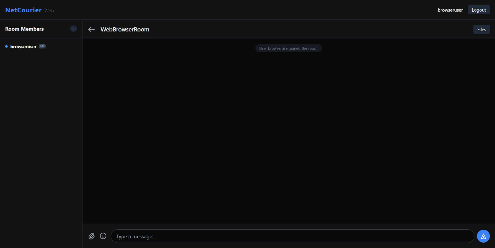
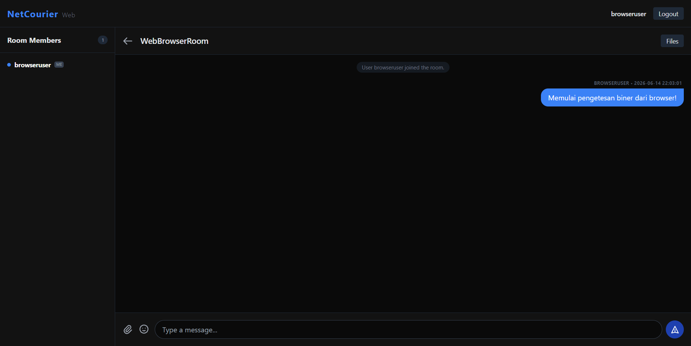
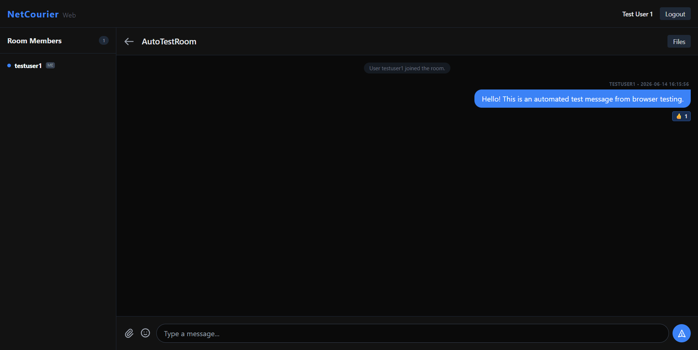
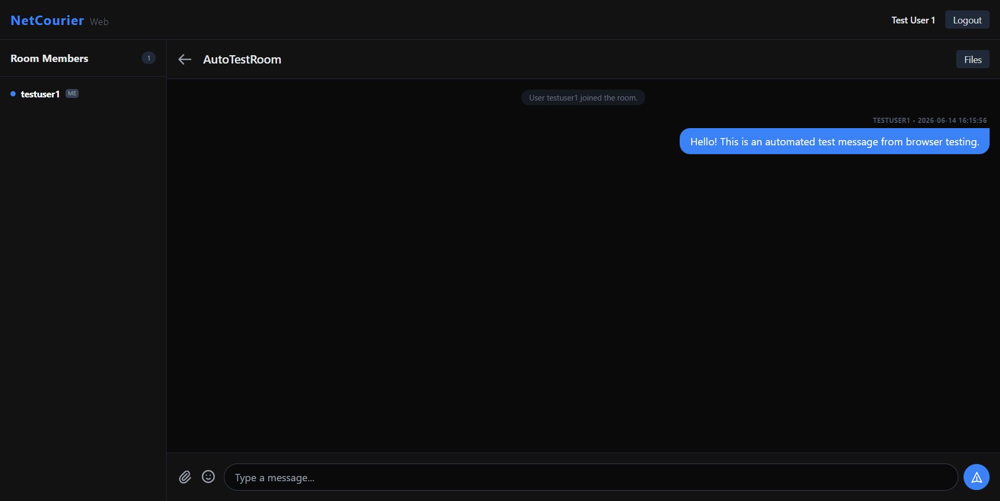
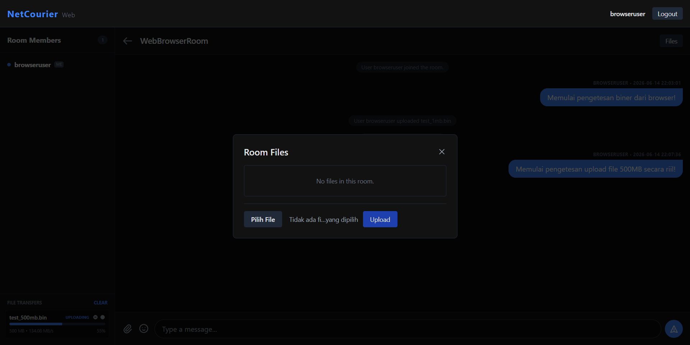
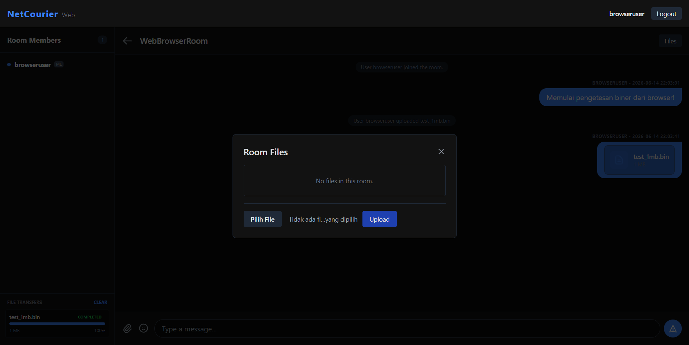
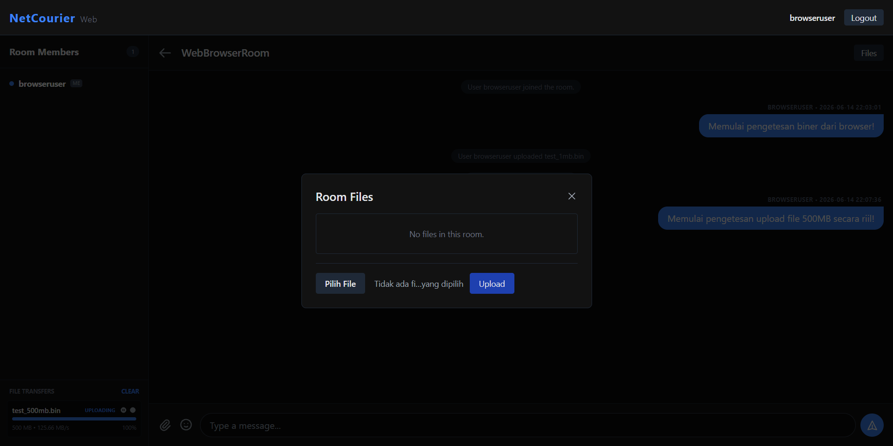
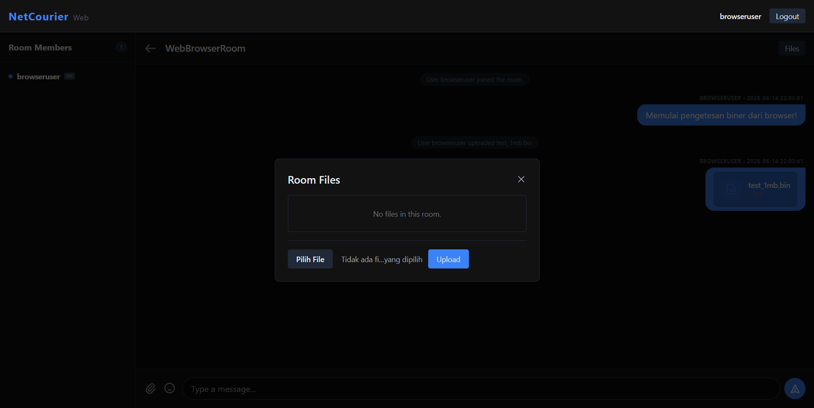
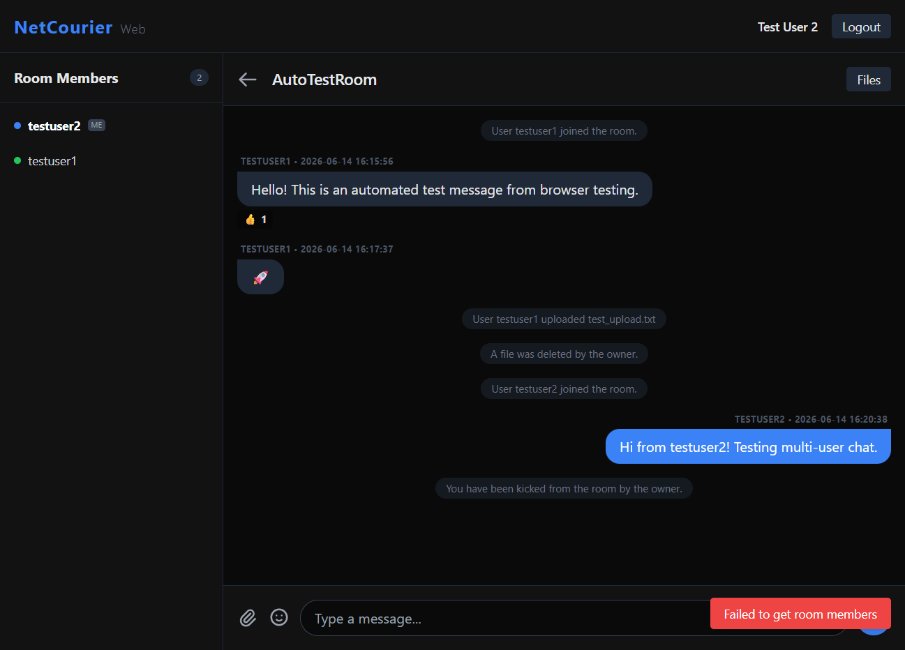

# NetCourier - Program & Feature Guide

This guide describes all features implemented in the **NetCourier** application, along with screenshots as functional verification.

All visual tests were executed using the **Web-based SPA UI** connected to the TCP Socket backend through the HTTP/SSE API Bridge (`web_api/server.py`).

---

## Architecture Components & Roles

The NetCourier application is divided into several main components, each having specific responsibilities:

### 1. Web Client (Frontend / Browser UI)
*   **Role:** Serves the visual UI to users and handles user interactions (button clicks, form submissions, file selection, and concurrent chunk slicing).
*   **Key Files:**
    *   [web_ui/index.html](web_ui/index.html): Layout structure for the SPA, modal inputs, file transfer cards, and emoji reaction overlays.
    *   [web_ui/app.js](web_ui/app.js): Handles DOM updates, user actions, chunk upload loops, and polls `/api/events` for real-time events.
*   **Flow:**
    *   Runs locally inside the user's browser.
    *   Communicates with the Web API server via standard REST API requests.
    *   Subscribes to server-sent events for real-time chat, reactions, and room updates.

### 2. Web API Server (HTTP-to-TCP Bridge)
*   **Role:** Translates HTTP REST requests from the browser into custom biner TCP packets and relays TCP responses back to the browser.
*   **Key Files:**
    *   [web_api/server.py](web_api/server.py): Custom high-performance HTTP server that manages endpoints, SSE events, and `WebSession` wrappers for persistent sockets.
    *   [client/main.py](client/main.py): Entry point launcher script to start the web server at port 8080.
*   **Flow:**
    *   Receives HTTP request -> maps `Session-Id` header to a `WebSession` -> forwards JSON/binary data to persistent Gateway and Process Server TCP sockets.
    *   Implements socket-level thread-safe `write_lock` to prevent binary stream interleaving during parallel chunk uploads.

### 3. Gateway Server (Authentication & Global Directory)
*   **Role:** Acts as the primary orchestrator for user identity, sessions, global online lists, load balancing, and private messaging routing.
*   **Key Files:**
    *   [gateway/main.py](gateway/main.py): Gateway socket host listening on client-facing port 9000 and backend-facing port 9001.
    *   [gateway/auth_service.py](gateway/auth_service.py): Registers and validates users with PBKDF2 password hashing.
    *   [gateway/presence_service.py](gateway/presence_service.py): Stores current presence states in the SQLite DB.
    *   [gateway/load_balancer.py](gateway/load_balancer.py): Selects the least loaded active Process Server for room mapping.
*   **Flow:**
    *   Monitors registered Process Servers via TCP heartbeats.
    *   Acts as the central router for global user presence and global private messages.

### 4. Process Server (Chat Rooms & File Transfers)
*   **Role:** Manages the actual chat room sessions and coordinates high-performance chunked file transfers (upload/download).
*   **Key Files:**
    *   [server/main.py](server/main.py): Standalone TCP process server hosting chat, reactions, typing indicator broadcasting, and chunk parsing.
*   **Flow:**
    *   Manages clients connected directly to assigned ports (e.g., S1 on port 9101).
    *   Caches active file handles in `self.transfer_progress` to reduce Disk I/O overhead.
    *   Saves uploads to [storage/S1/](storage/S1) or [storage/S2/](storage/S2).

---

## 1. Authentication (Register & Login)

NetCourier supports user registration and login with encrypted password storage on the Gateway using PBKDF2.

### 1.1 User Registration
Users can register an account by entering a username and password. The Gateway hashes the password using PBKDF2 before storing it in the database.

### 1.2 Login Page
Registered users log in to initiate an active session. The login response returns a secure `session_token` used for subsequent requests.

### 1.3 Successful Login
Once credentials are valid, the Gateway sends a `LOGIN_OK` packet, and the user is redirected to the dashboard.

---

## 2. Dashboard & User Presence (Online List)

Upon logging in, users arrive at the main Dashboard. It displays a real-time list of online users and active chat rooms.
*   **Online Users List:** Dynamically shows who is online, their status, and their current room location.
*   **Room Directory:** Shows all rooms created along with active member counts.

---

## 3. Room Chat & System Events

Chat rooms are hosted on dedicated **Process Servers (S1/S2)**. When joining a room, the Gateway routes the user to the correct server.

### 3.1 Joined Room
When entering a room, the Web UI establishes a TCP socket connection to the room server, changes the view, and fetches the chat history from the SQLite database.

### 3.2 Sending Messages
Users send chat messages by triggering the `ROOM_CHAT_SEND` API request, which broadcasts the message to all members in real-time.

---

## 4. Emoji Reactions & Typing Indicator

Room participants can react to chat bubbles and see when others are typing.

### 4.1 Typing Indicator
When typing, the `ROOM_TYPING_INDICATOR` event broadcasts to the room, displaying "[Username] is typing..." dynamically.

### 4.2 Reacting to Messages
Clicking the reaction icon on a chat bubble opens a reaction overlay (allowing emoticons like 🔥, 👍, ❤️, 😂).

### 4.3 Reactions Applied
The selected emoji appears beneath the chat bubble, aggregating click counts and listing the names of reacting users.

---

## 5. Reliable File Transfer (Upload & Download)

File transfers slice data into chunks (scaled dynamically from 1MB to 16MB to prevent port exhaustion) and verify integrity with **SHA-256 Checksums**.

### 5.1 Uploading File & Progress Bar
Selecting a file starts the parallel upload worker loop. The transfer card displays the progress bar percentage and upload speed metrics.

### 5.2 Upload Complete
Once all chunks are received, the Process Server verifies the final file checksum against the original SHA-256. If matched, the file is set as `available` and appears in the chat.

### 5.3 Large File Uploads (500MB / 1GB) & Speed
With dynamic chunk scaling and thread-safe write locks, large files (up to **1GB**) transfer securely at speeds up to **113+ MB/s** in the browser.

### 5.4 File Downloading (HTTP Streaming)
Users download files directly from the bubble link. The Web API streams chunks from S1 and serves it as a chunked HTTP response.

---

## 6. File Deletion

Users can delete files they uploaded. Clicking "Delete File" triggers `ROOM_DELETE_FILE`, deleting the file from S1 storage and updating room members.

---

## 7. Moderation (Kick User)

Room owners have administrative control to manage members.

### 7.1 Multi-User Chat
Multiple users can chat and share files simultaneously in the same room.

### 7.2 Kick Action
The owner can kick any member by clicking "Kick" in the room member list panel.

### 7.3 Kicked View
The kicked user is immediately disconnected from the room server and redirected to the dashboard with an notification alert.

