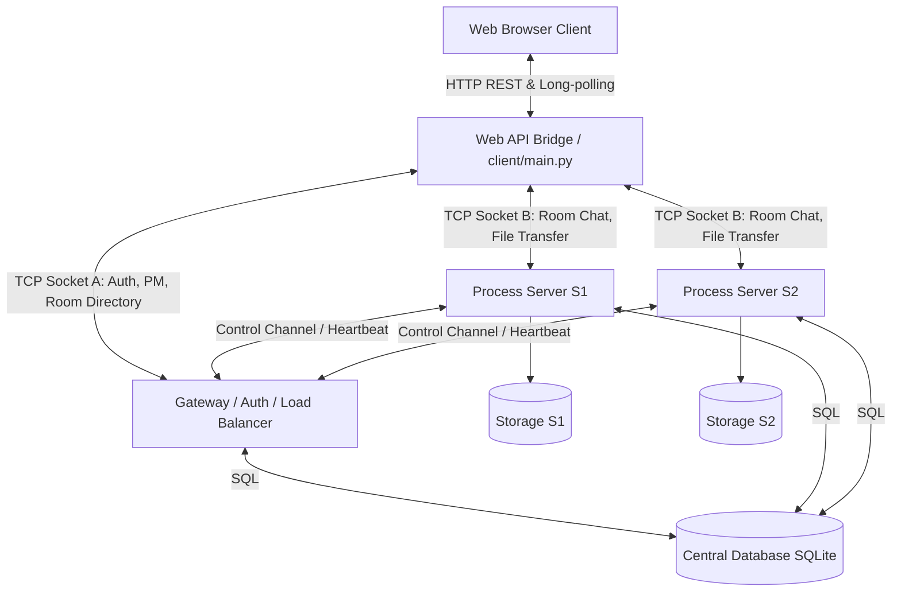

# NetCourier

**NetCourier** adalah aplikasi **Multi-Chat Room terdistribusi berbasis TCP Socket** dengan fitur unggulan **Reliable File Transfer berkinerja tinggi** dan **HTTP-to-TCP API Bridge** untuk antarmuka web.

Aplikasi ini memadukan kekuatan pemrograman jaringan tingkat rendah (raw TCP socket, thread-safe write locks, custom application protocol) dengan kemudahan akses antarmuka modern (Single Page Web UI berbasis HTML/JS).

---

## 1. Arsitektur Sistem

NetCourier menggunakan arsitektur terdistribusi yang memisahkan tanggung jawab autentikasi dan koordinasi global dengan manajemen ruang obrolan (*room chat*) dan transfer file.



### 1.1 Diagram Sekuensial (Sequence Diagram)

Berikut adalah alur komunikasi sekuensial yang menggambarkan proses **Join Room** dilanjutkan dengan **Reliable Chunked File Upload**:

```mermaid
sequenceDiagram
    autonumber
    actor Client as Browser Client
    participant API as Web API Bridge
    participant GW as Gateway Server
    participant S1 as Process Server (S1)
    database DB as SQLite Database

    %% Join Room & Location
    Note over Client, S1: 1. Alur Masuk Room (Join Room)
    Client->>API: POST /api/rooms/join (room_name)
    API->>GW: TCP: JOIN_ROOM
    GW->>DB: Query room mapping & server status
    DB-->>GW: Server S1 (127.0.0.1:9101)
    GW-->>API: TCP: ROOM_LOCATION
    API->>S1: Connect Socket & TCP: AUTH_BACKEND
    S1-->>API: TCP: AUTH_BACKEND_OK
    API->>S1: TCP: JOIN_ROOM_BACKEND
    S1-->>API: TCP: JOIN_ROOM_OK
    API-->>Client: 200 OK (success)

    %% Chunked Upload
    Note over Client, S1: 2. Alur Unggah Berkas Chunked (Reliable Chunked Upload)
    Client->>Client: Hitung Checksum SHA-256 File
    Client->>API: POST /api/rooms/files/upload?action=init (filesize, checksum)
    API->>S1: TCP: UPLOAD_INIT
    S1->>DB: Insert files & file_transfers record (status: in_progress)
    DB-->>S1: success
    S1-->>API: TCP: UPLOAD_READY (transfer_id)
    API-->>Client: 200 OK (transfer_id)

    loop Setiap Chunk 1MB - 16MB (Paralel 4 Workers)
        Client->>API: POST /api/rooms/files/upload?action=chunk (transfer_id, index, body)
        Note over API: Mengunci write_lock socket TCP
        API->>S1: TCP: UPLOAD_CHUNK (index, binary data)
        S1->>S1: Tulis data ke file handle cached pada disk
        Note over S1: Setiap kelipatan 20 chunks
        S1->>DB: Update completed_chunks & last_activity_at
        S1-->>API: TCP: CHUNK_ACK (index, status)
        API-->>Client: 200 OK
    end

    Client->>API: POST /api/rooms/files/upload?action=finish (transfer_id)
    API->>S1: TCP: UPLOAD_FINISH
    S1->>S1: Tutup cached file handle & Hitung SHA-256 berkas fisik
    S1->>DB: Verifikasi Checksum & Update file status ke 'available'
    DB-->>S1: success
    S1-->>API: TCP: UPLOAD_SUCCESS
    API-->>Client: 200 OK (success)
```

### 1.2 Komponen Utama
1.  **Web Client (Browser UI):** Single Page Application modern (vanilla HTML/CSS/JS) dengan visual premium, progress bar upload real-time, emoji reaction panel, daftar pengguna online, dan panel kontrol moderasi room.
2.  **Web API / HTTP Bridge (`web_api/server.py`):** Bertindak sebagai penerjemah (jembatan) yang mengubah request HTTP REST & event polling dari browser menjadi paket TCP socket biner untuk dikirim ke Gateway dan Process Server.
3.  **Gateway Server (`gateway/main.py`):** Menangani pendaftaran pengguna, autentikasi (kata sandi terenkripsi PBKDF2), manajemen sesi global, presensi online, pencatatan room, perutean private message global, dan *load balancing* berbasis room affinity.
4.  **Process Server (`server/main.py`):** Menangani aktivitas room chat (siaran obrolan, riwayat chat, typing indicator, emoji reaction), dan manajemen file transfer (chunking, checksum, pause/resume, delete file).
5.  **Central Database (SQLite):** Menyimpan persistent data seperti kredensial user, daftar room, riwayat obrolan/PM, daftar file, serta transaksi status transfer berkas.

---

## 2. Desain Protokol Aplikasi (Custom Application Layer)

Komunikasi antara client, gateway, dan process server berjalan di atas TCP socket dengan protokol biner khusus (*custom application layer protocol*) dengan struktur packet framing berikut:

```txt
+-----------------------+------------------------------------------+-----------------------+
|  Length Prefix (4B)   |               JSON Header                |    Binary Payload     |
|  (Int32 Big-Endian)   |           (UTF-8 encoded JSON)           |  (Raw Bytes, Opsional)|
+-----------------------+------------------------------------------+-----------------------+
```

*   **Length Prefix:** Integer 32-bit big-endian yang mendefinisikan panjang JSON Header.
*   **JSON Header:** String JSON terenkode UTF-8 yang berisi metadata paket, seperti `type` pesan, `request_id`, `token` autentikasi, dan `payload_size` data biner.
*   **Binary Payload:** Berisi byte mentah data berkas (hanya ada pada saat pengiriman potongan file / chunks).

### Contoh JSON Header:
```json
{
  "type": "ROOM_CHAT_SEND",
  "request_id": "REQ-000142",
  "token": "053e7da0-1f38-43dd-94ca-d6eb520d10b5",
  "payload_size": 0,
  "payload": {
    "room_name": "General",
    "message": "Halo semuanya!"
  }
}
```

---

## 3. Fitur Unggulan

### 3.1 Load Balancing & Room Affinity
Saat pengguna membuat room baru (`CREATE_ROOM`), Gateway menugaskan room tersebut ke **Process Server** yang memiliki beban paling rendah (berdasarkan kalkulasi heartbeat skor CPU/koneksi aktif). 
Sekali room ditugaskan ke sebuah server (misal S1), room tersebut akan terikat secara permanen (*room affinity*). Gateway akan merujuk semua pengguna yang ingin bergabung ke room tersebut ke server S1.

### 3.2 High-Performance Reliable File Transfer (113+ MB/s)
*   **Dynamic Chunk Size:** Chunk size dihitung secara dinamis (antara 1MB hingga 16MB) berdasarkan ukuran file. Untuk file besar seperti **1GB**, sistem menggunakan chunk 11MB sehingga hanya memerlukan 94 request HTTP. Hal ini mencegah TCP port exhaustion di sistem operasi lokal.
*   **File Handle Caching:** Open file handles disimpan di memori selama transfer chunk berjalan, mengeliminasi I/O disk overhead dari pembukaan/penutupan file per-chunk.
*   **Thread-Safe Write Locks:** Koneksi socket TCP dilindungi oleh locks agar pengiriman chunk paralel dari beberapa thread HTTP Web API ke Process Server tidak mengalami korupsi byte stream.
*   **Keutuhan Berkas (Checksum):** Setiap file diverifikasi menggunakan **SHA-256 Checksum** setelah upload selesai.

### 3.3 Resume Transfer (Unggah/Unduh)
Jika koneksi internet terputus di tengah proses transfer file, pengguna dapat melakukan klik **Resume**. Client akan meminta status chunk terakhir yang sukses ditulis ke Process Server melalui pesan `RESUME_TRANSFER`, lalu melanjutkan pengunggahan dari index chunk tersebut.

### 3.4 Moderasi & Interaksi Interaktif
*   **Emoji Reactions:** Pengguna dapat memberikan reaksi emoji secara real-time pada chat bubble pesan.
*   **Typing Indicator:** Memberikan efek visual "[User] sedang mengetik..." di room obrolan.
*   **Kick User:** Pembuat room (*room owner*) memiliki wewenang administratif untuk mendepak anggota room secara paksa dari panel member.

---

## 4. Cara Menjalankan Versi Demo Lokal

Sebelum memulai, pastikan Anda berada di direktori root project `netcourier`. Jalankan perintah-perintah berikut di terminal terpisah:

### Terminal 1: Gateway Server
```bash
python -m gateway.main
```
Gateway akan meluncurkan database SQLite secara otomatis jika file `data/netcourier.db` belum ada.

### Terminal 2: Process Server S1
```bash
python -m server.main --server-id S1 --port 9101
```

### Terminal 3: Process Server S2 (Opsional)
```bash
python -m server.main --server-id S2 --port 9102
```

### Terminal 4: Web Client & API Server
```bash
python -m client.main
```
Akses antarmuka aplikasi melalui peramban (browser) di alamat **http://localhost:8080**.

---

## 5. Panduan Pengguna & Tangkapan Layar Fitur

Untuk penjelasan detail setiap fitur program lengkap dengan panduan penggunaan visual dan bukti screenshot (Autentikasi, Chat Room, Reaksi Emoji, Transfer File Besar 1GB, Kecepatan, Moderasi Kick, dll.), silakan buka dokumentasi:

👉 **[PROGRAM_GUIDE.md](PROGRAM_GUIDE.md)**
