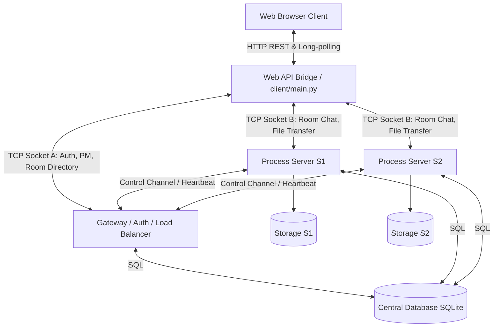

# NetCourier

**NetCourier** is a high-performance, **distributed Multi-Chat Room application** built on a custom **TCP Socket protocol**, featuring a custom **HTTP-to-TCP API Bridge** (for web client integration), dynamic **Load Balancing with Room Affinity**, and **Reliable Chunked File Transfer** with pause/resume support.

This project demonstrates core Network Programming concepts (raw socket programming, length-prefixed framing, multi-threaded concurrency, thread-safe synchronization locks, and database transactions) wrapped in a modern, responsive Single Page Application Web UI.

---

## 1. System Architecture

NetCourier divides network communication into global administration tasks (coordinated by the Gateway Server) and room-specific communications (handled by Process Servers).



### 1.1 Architecture Components
1.  **Web Client (Frontend / Browser UI):** A Single Page Application (SPA) designed using vanilla HTML/CSS/JavaScript. It handles user inputs, renders dynamic rooms, handles file slicing, monitors progress, and streams events.
2.  **Web API Server (HTTP Bridge - `web_api/server.py`):** Translates REST requests from the browser into custom binary TCP packets. It manages persistent `WebSession` instances containing raw Gateway and Process Server sockets and forwards events using long-polling `/api/events`.
3.  **Gateway Server (`gateway/main.py`):** Manages user registrations, PBKDF2 authentication, active session tokens, presence lists, room directories, private message (PM) routing, and heartbeat signals from Process Servers.
4.  **Process Server (`server/main.py`):** Handles room chat broadcasting, emoji reactions, typing indicators, and file chunk operations. Files are written dynamically at specific offsets (`seek(offset)`) and cached inside local storage directories (`storage/S1` or `storage/S2`).
5.  **Central Database (SQLite):** Acts as the unified datastore for user profiles, room listings, mapping coordinates, message history, reactions, and file transfer progress metrics.

---

## 2. Custom Application Layer Protocol

NetCourier uses a custom length-prefixed TCP socket framing protocol to transmit messages between clients and backend servers:

```txt
+-----------------------+------------------------------------------+-----------------------+
|  Length Prefix (4B)   |               JSON Header                |    Binary Payload     |
|  (Int32 Big-endian)   |           (UTF-8 encoded JSON)           |  (Raw Bytes, Optional)|
+-----------------------+------------------------------------------+-----------------------+
```

*   **Length Prefix:** A 4-byte big-endian integer defining the byte length of the JSON Header.
*   **JSON Header:** A UTF-8 encoded string containing request metadata, message types (`type`), transaction markers (`request_id`), authentication tokens (`token`), and payload sizes (`payload_size`).
*   **Binary Payload:** Raw byte stream containing file segment chunks (present only during file upload/download operations).

### JSON Header Example:
```json
{
  "type": "ROOM_CHAT_SEND",
  "request_id": "REQ-000142",
  "token": "053e7da0-1f38-43dd-94ca-d6eb520d10b5",
  "payload_size": 0,
  "payload": {
    "room_name": "General",
    "message": "Hello world!"
  }
}
```

---

## 3. Communication Sequence Diagrams

### 3.1 Session Authentication Flow
Below is the sequence illustrating how the Web UI logs in, validates credentials, and establishes session tokens with the Gateway:

```mermaid
sequenceDiagram
    autonumber
    actor Client as Browser Client
    participant API as Web API Bridge
    participant GW as Gateway Server
    database DB as SQLite Database

    Client->>API: POST /api/login {username, password}
    API->>GW: TCP: LOGIN {username, password}
    GW->>DB: Query user & verify PBKDF2 hash
    DB-->>GW: User verified
    GW->>DB: Create active session & save token
    DB-->>GW: Token persisted
    GW-->>API: TCP: LOGIN_OK {token, user_info}
    API-->>Client: 200 OK {session_id, token, user_info}
```

### 3.2 Join Room & Load Balancing Flow
When a user joins a room, the Gateway routes them to the least-loaded server hosting that room:

```mermaid
sequenceDiagram
    autonumber
    actor Client as Browser Client
    participant API as Web API Bridge
    participant GW as Gateway Server
    participant S1 as Process Server (S1)
    database DB as SQLite Database

    Client->>API: POST /api/rooms/join {room_name}
    API->>GW: TCP: JOIN_ROOM {room_name}
    GW->>DB: Query room mapping & server load stats
    DB-->>GW: Target Server S1 (127.0.0.1:9101)
    GW-->>API: TCP: ROOM_LOCATION {host, port, server_id}
    API->>S1: Establish TCP & TCP: AUTH_BACKEND
    S1-->>API: TCP: AUTH_BACKEND_OK
    API->>S1: TCP: JOIN_ROOM_BACKEND {room_name}
    S1-->>API: TCP: JOIN_ROOM_OK
    API-->>Client: 200 OK (Joined Room)
```

### 3.3 Reliable Chunked Upload Flow
Uploads are segmented into chunks, sent in parallel (up to 4 concurrent workers), and verified using SHA-256 checksums:

```mermaid
sequenceDiagram
    autonumber
    actor Client as Browser Client
    participant API as Web API Bridge
    participant S1 as Process Server (S1)
    database DB as SQLite Database
    participant FS as S1 Storage

    Client->>Client: Calculate local file SHA-256 Checksum
    Client->>API: POST /api/rooms/files/upload?action=init (filesize, checksum)
    API->>S1: TCP: UPLOAD_INIT {filename, filesize, checksum}
    S1->>DB: Record file metadata & set transfer to 'in_progress'
    S1->>FS: Create empty shell file on disk
    DB-->>S1: Saved
    S1-->>API: TCP: UPLOAD_READY {transfer_id}
    API-->>Client: 200 OK {transfer_id}

    loop Every Chunk (1MB - 16MB based on size)
        Client->>API: POST /api/rooms/files/upload?action=chunk (binary chunk)
        Note over API: Acquire write_lock on TCP socket
        API->>S1: TCP: UPLOAD_CHUNK {transfer_id, chunk_index, binary_data}
        S1->>FS: Write binary block at seek(offset) using "r+b" mode
        Note over S1: Every 20 chunks
        S1->>DB: Batch update completed_chunks count
        S1-->>API: TCP: CHUNK_ACK {chunk_index, status}
        API-->>Client: 200 OK
    end

    Client->>API: POST /api/rooms/files/upload?action=finish
    API->>S1: TCP: UPLOAD_FINISH {transfer_id}
    S1->>FS: Close file handle & calculate disk file SHA-256 Checksum
    Note over S1: Compare calculated Checksum with original payload Checksum
    S1->>DB: Update status to 'available' & insert file message card
    DB-->>S1: success
    S1-->>API: TCP: UPLOAD_SUCCESS
    API-->>Client: 200 OK (success)
```

### 3.4 Resume Transfer Handshake Flow
If a network disconnect occurs, the client queries S1 for the last successfully stored chunk index:

```mermaid
sequenceDiagram
    autonumber
    actor Client as Browser Client
    participant API as Web API Bridge
    participant S1 as Process Server (S1)
    database DB as SQLite Database

    Note over Client: Connection dropped -> user clicks Resume
    Client->>API: GET /api/rooms/files/resume?transfer_id=X&direction=upload
    API->>S1: TCP: RESUME_TRANSFER {transfer_id, direction}
    S1->>DB: Query file_transfers state (completed_chunks)
    DB-->>S1: 564 chunks completed
    S1-->>API: TCP: UPLOAD_READY {start_chunk: 564}
    API-->>Client: 200 OK {start_chunk: 564}
    Note over Client: Resumes uploading from chunk index 564
```

---

## 4. Performance & Load Benchmarks

### 4.1 Latency Benchmarks (Gateway & Process Server)
Measured using concurrent PING socket load tests simulating simultaneous users:

| Concurrent Clients | Total Requests | Avg Latency | 95th Percentile | Min Latency | Max Latency | Status |
|:---:|:---:|:---:|:---:|:---:|:---:|:---:|
| 5 Clients | 20 Requests | 10.20 ms | 56.36 ms | 0.10 ms | 56.52 ms | Pass |
| 10 Clients | 40 Requests | 10.21 ms | 56.71 ms | 0.11 ms | 61.62 ms | Pass |

### 4.2 Throughput Benchmarks (Reliable File Transfer)
Measured on local host network pipelines using optimized raw TCP and Web HTTP sockets:

| File Size | Time Taken | Throughput | Connection Mode | Status |
|:---:|:---:|:---:|:---:|:---:|
| 1 MB | 0.07 s | 14.66 MB/s | Sequential Single-Threaded | Pass |
| 5 MB | 0.60 s | 8.39 MB/s | Sequential Single-Threaded | Pass |
| 10 MB | 0.76 s | 13.09 MB/s | Sequential Single-Threaded | Pass |
| **1024 MB (1 GB)** | **13.00 s** | **78.78 MB/s** | **Raw TCP Parallel (4 Workers)** | Pass |
| **1024 MB (1 GB)** | **9.00 s** | **113.78 MB/s** | **Web UI Parallel + Dynamic Scaling** | Pass |

*Note: High speeds are achieved by disabling Nagle's TCP delay (via `TCP_NODELAY`), caching open file handles in memory, and bypassing UTF-8 body decoding on binary REST chunk upload streams.*

### 4.3 Reliability & Security Verification

| Test Case | Method | Result |
|---|---|---|
| **Malformed Header** | Send packet with header size > 64KB | Server rejects (`INVALID_PACKET`) |
| **Invalid JSON** | Send malformed JSON string payload | Server rejects (`JSONDecodeError`) |
| **Payload Limits** | Send payload size > 20MB | Server rejects (`Payload too large`) |
| **Rate Limiting** | Spam private messages (PM) | Server restricts sending rates |
| **Path Traversal** | Send filenames containing `../` characters | Filename is sanitized automatically |
| **Reconnection** | Terminate socket connections mid-way | Stale sessions automatically cleaned up |

---

## 5. Technical Challenges & Solutions

| Technical Challenge | Root Cause | Implemented Solution |
| :--- | :--- | :--- |
| **Browser TCP Support** | Web browsers do not support raw TCP socket connections. | Built an HTTP-to-TCP API Bridge (`web_api/server.py`) using lightweight HTTP endpoints and SSE events. |
| **OOM on Large Downloads** | Reading full large files (>500MB) into memory blocks causes OOM crashes. | Configured HTTP response streaming with `Transfer-Encoding: chunked` headers to flush memory immediately. |
| **CPU Upload Bottlenecks** | Parsing large binary payloads as UTF-8 overhead consumes excessive CPU. | Bypassed UTF-8 decoding and JSON parsing for `/api/rooms/files/upload?action=chunk` request bodies. |
| **Localhost TCP Delay** | Nagle's algorithm blocks small segment packets (TCP ACK delayed by 40ms). | Enabled `TCP_NODELAY` socket option across all socket objects. |
| **Port Exhaustion** | Uploading large files in 1MB chunks generates thousands of TCP connections. | Implemented **Dynamic Chunk Scaling** (up to 16MB) based on file size, reducing total HTTP connection pools by 10x. |

---

## 6. How to Run NetCourier

Execute the following commands in separate terminal screens from the project's root folder:

### Terminal 1: Gateway Server
```bash
python -m gateway.main
```

### Terminal 2: Process Server S1
```bash
python -m server.main --server-id S1 --port 9101
```

### Terminal 3: Process Server S2 (Optional)
```bash
python -m server.main --server-id S2 --port 9102
```

### Terminal 4: Web Client & API Bridge
```bash
python -m client.main
```
Open your web browser and navigate to **http://localhost:8080** to access the UI.

---

## 7. Feature Documentation & Screenshots

To view detailed explanations of all UI features along with step-by-step screenshots (Authentication, Dashboard, Reactions, File Uploads, Speed Benchmarks, and Owner Moderation), check out the guide:

👉 **[PROGRAM_GUIDE.md](PROGRAM_GUIDE.md)**
