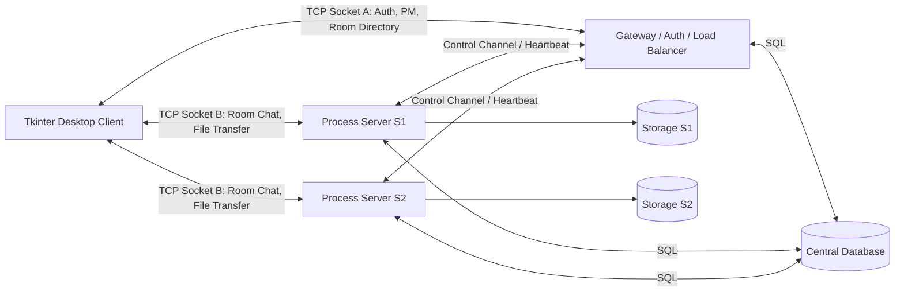
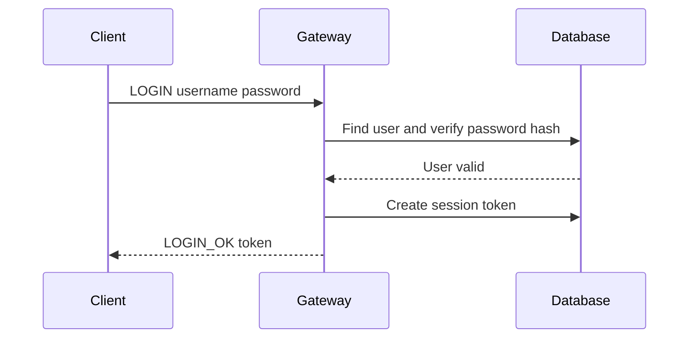
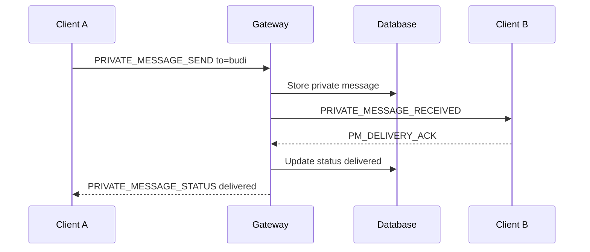
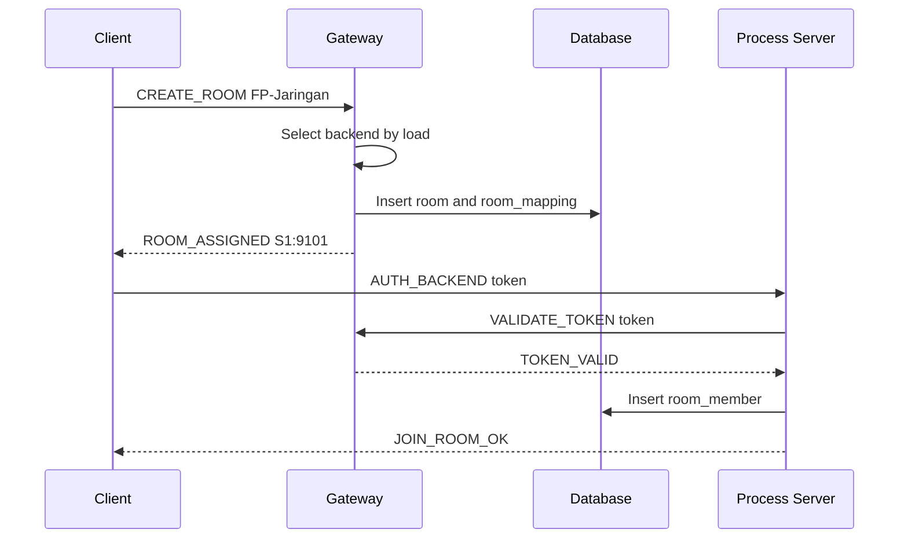
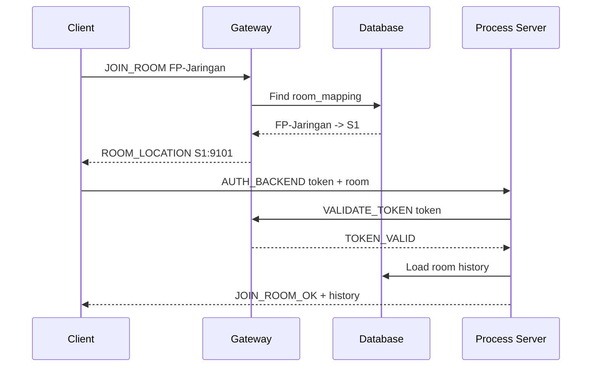
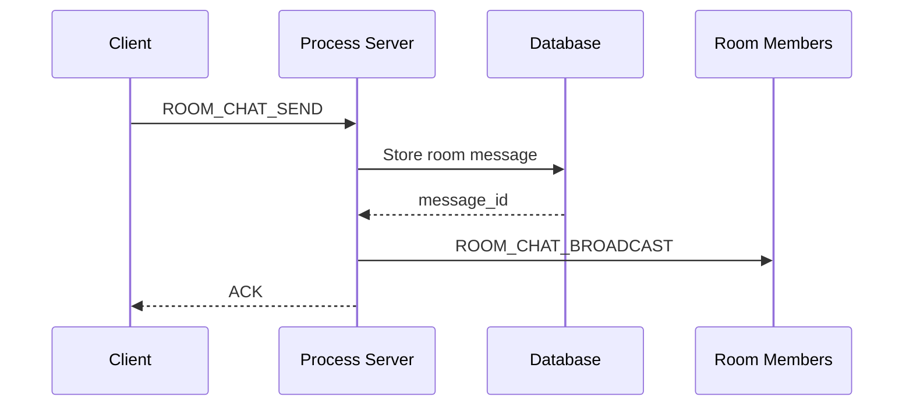
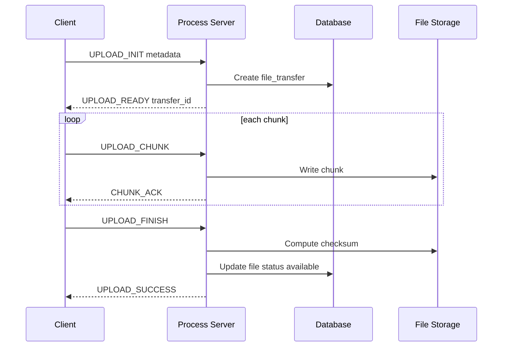

# Architecture - NetCourier

## 1. Architecture Style

NetCourier menggunakan **distributed client-server architecture** dengan tiga bagian utama:

1. **Gateway / Auth Server / Load Balancer**
2. **Process Server S1/S2**
3. **Central Database + File Storage**

Gateway menangani fitur global. Process Server menangani room chat dan file transfer. Database menyimpan data persisten.

---

## 2. High-Level Architecture



---

## 3. Process View

Minimal proses yang berjalan saat demo:

```txt
Terminal 1:
python gateway/main.py --client-port 9000 --backend-port 9001

Terminal 2:
python server/server.py --server-id S1 --port 9101 --gateway-port 9001

Terminal 3:
python server/server.py --server-id S2 --port 9102 --gateway-port 9001

Terminal 4+:
python client/main.py --gateway-host 127.0.0.1 --gateway-port 9000
```

---

## 4. Port Design

| Component | Port | Fungsi |
|---|---:|---|
| Gateway client-facing | 9000 | Client login, PM, room directory |
| Gateway backend-control | 9001 | Backend register, heartbeat, token validation |
| Process Server S1 | 9101 | Room chat dan file transfer |
| Process Server S2 | 9102 | Room chat dan file transfer |
| Database | 5432 / file SQLite | Central DB |

---

## 5. Component Responsibility

## 5.1 Tkinter Desktop Client

Tugas:
- membuka desktop GUI berbasis Tkinter,
- connect ke Gateway,
- login/register melalui form,
- menjaga Gateway receiver thread untuk PM,
- request room list dan menampilkan tabel room,
- create/join room melalui tombol/form,
- connect ke Process Server,
- menjaga room receiver thread untuk room chat/file events,
- upload/download file melalui file picker dan tombol,
- menampilkan progress dengan progress bar,
- memproses event socket melalui thread-safe UI queue agar GUI tidak freeze.

Client punya dua koneksi:
- **Gateway connection**: selalu aktif selama user login.
- **Room connection**: aktif saat user berada di room.

---

## 5.2 Gateway

Tugas:
- register/login/logout,
- session token,
- duplicate login handling,
- online user global,
- PM global,
- PM history,
- room directory,
- room mapping,
- load balancing,
- backend registry,
- backend heartbeat,
- token validation untuk Process Server.

Gateway tidak menangani:
- room broadcast message,
- file upload/download besar.

Alasan:
- file besar tidak lewat Gateway agar Gateway tidak menjadi bottleneck.

---

## 5.3 Process Server

Tugas:
- menerima client yang sudah diarahkan Gateway,
- validasi token ke Gateway,
- join/leave room,
- broadcast room chat,
- room chat history,
- file list,
- upload/download file,
- chunking,
- checksum validation,
- resume transfer,
- update database,
- simpan file fisik di storage lokal.

Process Server juga membuka control channel ke Gateway untuk:
- register backend,
- heartbeat,
- room stats update,
- user presence update,
- token validation request jika dibutuhkan.

---

## 5.4 Central Database

Menyimpan:
- users,
- sessions,
- backend_servers,
- room_mapping,
- user_presence,
- rooms,
- room_members,
- room_messages,
- private_messages,
- files metadata,
- file_transfers,
- transfer_chunks,
- server_logs,
- performance_metrics.

Catatan:
- file fisik tidak disimpan di database,
- database hanya menyimpan path dan metadata file.

---

## 5.5 File Storage

File fisik disimpan per Process Server.

Contoh:
```txt
storage/
├── S1/
│   └── rooms/
│       └── fp-jaringan/
│           └── 20260609_abc_laporan.pdf
└── S2/
    └── rooms/
        └── kelompok-a/
            └── 20260609_xyz_source.zip
```

Karena menggunakan room affinity, satu room hanya berada pada satu Process Server. Maka file room cukup disimpan di server pemilik room.

---

## 6. Room Affinity

### Problem
Jika user dalam room yang sama masuk server berbeda, room chat dan file transfer akan pecah.

### Solution
Gateway menerapkan **room affinity**:

```txt
room_name -> server_id
```

Contoh:
```txt
FP-Jaringan -> S1
Kelompok-A  -> S2
Tubes-Socket -> S1
```

Semua user yang join `FP-Jaringan` selalu diarahkan ke S1.

---

## 7. Load Balancing

### Algorithm

Gateway memilih server untuk room baru dengan skor:

```txt
score = active_rooms * 10 + active_clients + active_transfers * 2
```

Server dengan score paling rendah dipilih.

Jika score sama:
- gunakan round-robin.

### Health Check

Backend mengirim heartbeat setiap 5 detik.

Jika Gateway tidak menerima heartbeat lebih dari 15 detik:
- status backend menjadi `down`,
- Gateway tidak mengarahkan room baru ke backend tersebut.

---

## 8. Main Data Flows

## 8.1 Login Flow



---

## 8.2 Private Message Flow



PM tetap berjalan walaupun B sedang berada di room karena B masih memiliki koneksi aktif ke Gateway.

---

## 8.3 Create Room Flow



---

## 8.4 Join Room Flow



---

## 8.5 Room Chat Flow



---

## 8.6 File Upload Flow



---

## 9. Concurrency Model

### Gateway
- thread per client connection,
- thread per backend control connection,
- lock for `active_sessions`,
- lock for `connected_users`,
- lock for backend registry.

### Process Server
- thread per client connection,
- thread for gateway control/heartbeat,
- lock per room for member list,
- lock per transfer for chunk state,
- lock for socket sending.

### Client
- Tkinter main thread untuk event loop dan update widget,
- gateway receiver thread,
- room receiver thread,
- upload/download worker thread,
- thread-safe `queue.Queue` untuk mengirim event dari socket thread ke Tkinter main thread.

---

## 9.1 Tkinter Threading Rule

Tkinter tidak thread-safe. Karena itu, receiver thread dan worker thread tidak boleh mengubah widget secara langsung. Semua event jaringan harus dimasukkan ke `queue.Queue`, lalu Tkinter main thread mengambil event tersebut menggunakan `root.after(...)`.

Contoh alur:

```txt
Gateway receiver thread -> ui_event_queue.put(event)
Room receiver thread    -> ui_event_queue.put(event)
Tkinter main thread     -> root.after(50, process_ui_queue)
```

Aturan ini wajib agar UI tidak freeze dan tidak crash saat menerima pesan real-time atau progress transfer.

---

## 10. Failure Handling

| Failure | Handling |
|---|---|
| Client disconnect dari Gateway | session inactive, presence offline |
| Client disconnect dari room | room membership inactive, transfer interrupted |
| Process Server heartbeat hilang | Gateway mark backend down |
| Malformed packet | kirim ERROR, log, koneksi boleh tetap aktif |
| Checksum gagal | file status corrupted |
| Duplicate login | tolak login baru atau disconnect session lama |
| File transfer timeout | transfer status interrupted |
| Database error | return `ERROR INTERNAL_ERROR`, log detail |

---

## 11. Deployment Options

### Option A: Localhost Demo

Semua proses berjalan di satu laptop, beda port.

### Option B: LAN Demo

Gateway dan server di satu laptop, client teman satu WiFi connect ke IP laptop.

### Option C: VPS Demo

Gateway dan Process Server dijalankan di VPS. Client connect ke IP public Gateway.

---

## 12. Architecture Rules

1. Client tidak boleh akses database langsung.
2. Client login hanya ke Gateway.
3. PM selalu lewat Gateway.
4. Room chat selalu lewat Process Server.
5. File transfer selalu lewat Process Server.
6. Gateway tidak memproses file besar.
7. Room yang sama tidak boleh tersebar ke beberapa Process Server.
8. Protocol encoding/decoding harus memakai module `common/protocol.py`.
9. Setiap handler harus validasi token dan required fields.
10. Jangan membuat fitur di luar requirement tanpa update docs.
