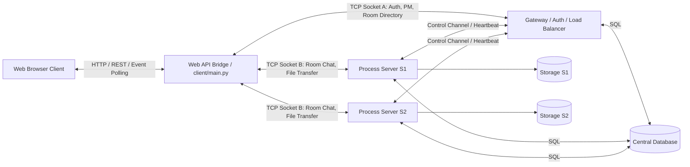
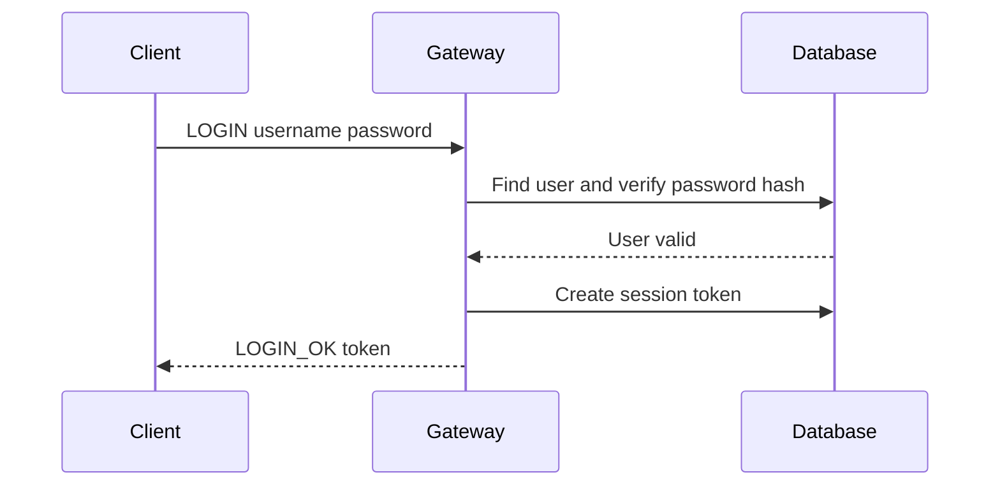
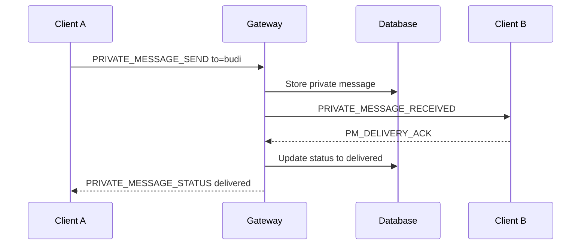
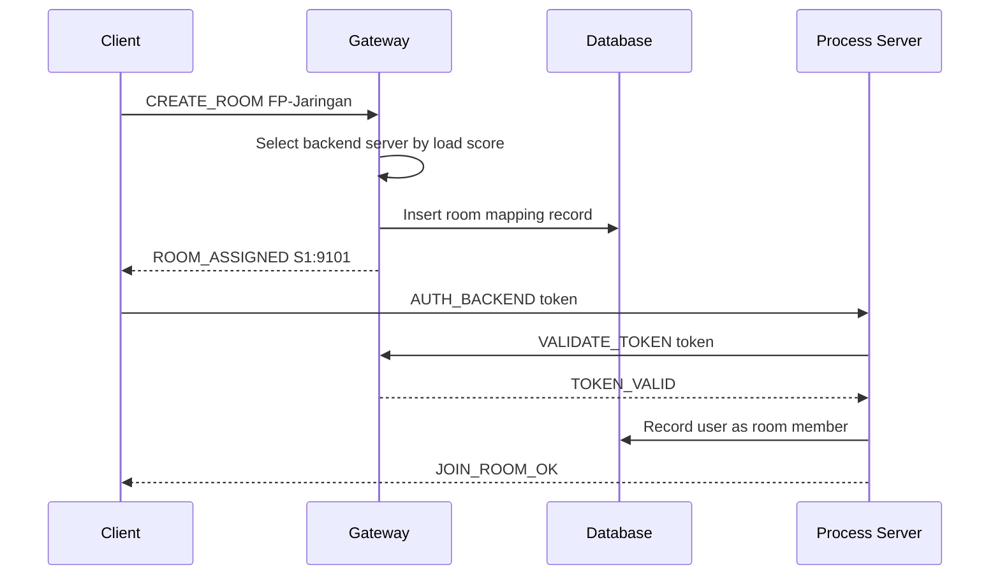
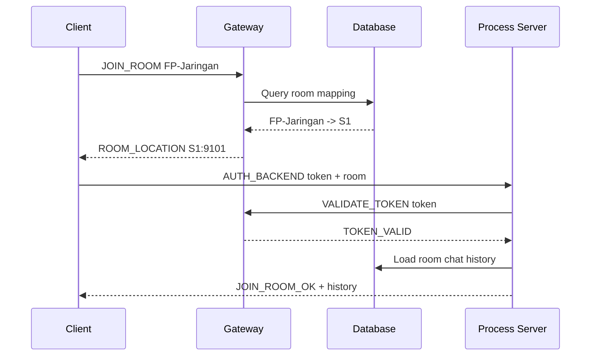
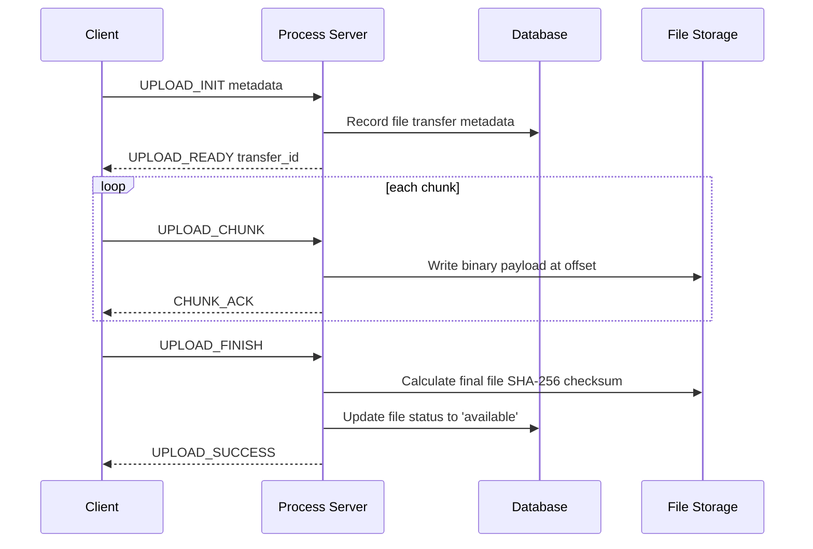

# Architecture - NetCourier

## 1. Architecture Style

NetCourier utilizes a **distributed client-server architecture** comprising three primary components:

1. **Gateway / Authentication Server / Load Balancer**
2. **Process Servers (S1/S2)**
3. **Central Database + File Storage**

The Gateway handles global coordination and control plane operations (auth, sessions, routing, load balancing). Process Servers handle the real-time data plane (chat broadcasting, reactions, file transfers). The Database stores persistent application data.

---

## 2. High-Level Architecture



---

## 3. Process View

Minimum running processes for a typical demonstration:

```txt
Terminal 1:
python gateway/main.py --client-port 9000 --backend-port 9001

Terminal 2:
python server/server.py --server-id S1 --port 9101 --gateway-port 9001

Terminal 3:
python server/server.py --server-id S2 --port 9102 --gateway-port 9001

Terminal 4+:
python client/main.py --gateway-host 127.0.0.1 --gateway-port 9000
```

---

## 4. Port Design

| Component | Port | Function |
|---|---:|---|
| Gateway client-facing | 9000 | Client login, PM routing, room directory operations |
| Gateway backend-control | 9001 | Backend server registration, heartbeats, token validation |
| Process Server S1 | 9101 | Chat room broadcasting and chunked file transfers |
| Process Server S2 | 9102 | Chat room broadcasting and chunked file transfers |
| Database | N/A (SQLite) | Persistent SQLite database file |

---

## 5. Component Responsibilities

### 5.1 Web Client & API Bridge

Responsibilities:
- **Browser:** Renders the Web UI built on vanilla HTML/CSS/JS.
- **Web API Server (`client/main.py` / `web_api/server.py`):** Acts as a bridge between the browser's REST API requests and the underlying TCP sockets connected to the backend servers.
- **Authentication & PM:** Forwards login, registration, and PM requests from REST API endpoints to the Gateway over TCP.
- **Connection Management:** Maintains background TCP socket connections to the Gateway and the currently joined Process Server per user session.
- **Event Dispatching:** Implements long-polling (`/api/events`) to forward asynchronous socket events (new messages, user arrivals, reaction changes) to the browser in real-time.
- **File Transfer:** Coordinates chunk-by-chunk file uploads and downloads between the browser client and the Process Server.

Clients maintain two active logical connections:
- **Gateway Connection:** Active throughout the user's login session.
- **Room Connection:** Active only while the user is actively inside a chat room.

---

### 5.2 Gateway

Responsibilities:
- User registration, login verification (PBKDF2), and logout.
- Session token generation and validation.
- Handling duplicate login attempts (disconnecting previous sessions).
- Tracking global online users and routing Private Messages (PM).
- Maintaining PM history records.
- Maintaining the directory of active rooms and their server mappings.
- Load balancing new room allocations.
- Registering backend Process Servers and receiving heartbeat updates.
- Validating session tokens requested by Process Servers.

The Gateway **does not** handle:
- Room chat broadcasting.
- High-volume file upload or download chunks.

*Rationale: Large binary file transfers bypass the Gateway entirely, preventing the Gateway from becoming a bandwidth or processing bottleneck.*

---

### 5.3 Process Server

Responsibilities:
- Accepting connections from clients routed to the server.
- Validating client session tokens against the Gateway.
- Managing room joins and leaves.
- Broadcasting chat messages, typing indicators, and emoji reactions to room members.
- Fetching and returning room chat histories.
- Fetching and returning room file listings.
- Handling file upload and download initialization.
- Managing chunked byte writing and reading.
- Performing SHA-256 checksum validation upon file upload completion.
- Supporting file transfer resumption (resuming upload/download after disconnection).
- Saving physical files to local disk storage.
- Updating database states for files and transfers.

Process Servers also maintain an active control channel socket to the Gateway for:
- Backend server registration.
- Periodic heartbeat packets.
- Real-time room status and user count updates.
- Real-time client presence status updates.
- Direct token validation queries.

---

### 5.4 Central Database

Stores:
- `users` (credentials and profile info)
- `sessions` (active session tokens)
- `backend_servers` (active backend nodes and load metrics)
- `room_mapping` (room allocations to server IDs)
- `user_presence` (presence indicators)
- `rooms` (room names and metadata)
- `room_members` (active room participants)
- `room_messages` (chat messages inside rooms)
- `private_messages` (private chat messages)
- `files` (uploaded files metadata)
- `file_transfers` (upload/download transaction state)
- `transfer_chunks` (indices of written/verified chunks)
- `server_logs` (server operations audit logs)
- `performance_metrics` (latency and throughput benchmarks)

*Note: Physical files are not stored in the database. The database only tracks file metadata, SHA-256 hashes, sizes, and file paths.*

---

### 5.5 File Storage

Physical files are stored locally in the directory assigned to each Process Server.

Structure:
```txt
storage/
├── S1/
│   └── rooms/
│       └── fp-jaringan/
│           └── 20260609_abc_laporan.pdf
└── S2/
    └── rooms/
        └── kelompok-a/
            └── 20260609_xyz_source.zip
```

Because NetCourier utilizes room affinity, a specific room is always bound to a single Process Server. Thus, all files uploaded to that room are safely kept on the local disk of the hosting server.

---

## 6. Room Affinity

### The Problem
If users participating in the same chat room are connected to different backend servers, broadcasting messages, managing typing indicators, and coordinating file transfers would require complex cross-server synchronization.

### The Solution
The Gateway enforces **room affinity**:

```txt
room_name -> server_id
```

Example:
```txt
FP-Jaringan  -> S1
Kelompok-A   -> S2
Tubes-Socket -> S1
```

All users joining `FP-Jaringan` are dynamically routed to Process Server `S1`.

---

## 7. Load Balancing

### Selection Algorithm
When a new room is created, the Gateway selects the least-loaded server according to a load score:

```txt
score = (active_rooms * 10) + active_clients + (active_transfers * 2)
```

The server with the lowest score is selected. If multiple servers share the same score, the selection falls back to a simple round-robin distribution.

### Health Monitoring
Backend servers transmit a heartbeat packet every 5 seconds. If the Gateway fails to receive a heartbeat from a server for more than 15 seconds:
- The server's status is marked as `down` in the database.
- The Gateway stops routing new room creations to that server.
- Active connections associated with that server are cleaned up.

---

## 8. Main Data Flows

### 8.1 Login Flow



---

### 8.2 Private Message Flow



*Note: Private messaging functions seamlessly even if user B is actively inside a chat room, as B maintains an active connection to the Gateway parallel to their room connection.*

---

### 8.3 Create Room Flow



---

### 8.4 Join Room Flow



---

### 8.5 Room Chat Flow


---

### 8.6 File Upload Flow



---

### 8.7 File Transfer Optimizations

To handle large file uploads (500MB to 1GB+) at maximum speed over localhost, NetCourier implements several optimizations:

1. **Bypass UTF-8 Body Decoding:** The REST API gateway in the Web API Bridge (`web_api/server.py`) bypasses UTF-8 decoding and JSON parsing for binary upload requests (`/api/rooms/files/upload?action=chunk`), saving CPU cycles and preventing memory bloat.
2. **TCP_NODELAY Option:** All TCP sockets (client-to-gateway, backend-to-gateway, client-to-server, and client HTTP socket connections) are configured with `TCP_NODELAY` to disable Nagle's algorithm, avoiding standard TCP ACK delays (40ms) on localhost.
3. **Parallel Chunk Uploads:** The web client (`web_ui/app.js`) uploads file chunks concurrently using a worker pool with a maximum concurrency of 4 requests.
4. **Out-of-Order Writes & Touch pre-allocation:** The Process Server (`server/main.py`) pre-allocates the empty target file on disk during the `UPLOAD_INIT` phase and opens it in `"r+b"` mode, writing chunks using explicit `seek(offset)`. This ensures chunks are written correctly even if they arrive out of order or concurrently.

---

## 9. Concurrency Model

### Gateway
- One dedicated thread per client connection.
- One dedicated thread per backend control connection.
- Explicit locks to synchronize access to `active_sessions`.
- Explicit locks to synchronize access to `connected_users`.
- Explicit locks to synchronize access to the `backend_servers` registry.

### Process Server
- One dedicated thread per client connection.
- One dedicated thread for handling gateway heartbeats and control updates.
- Lock per room to protect the room's active participant list.
- Lock per file transfer transaction to protect chunk state records.
- Lock per socket to serialize sending packets.

### Client (Web Client & API Bridge)
- Browser main thread handles JavaScript execution and DOM updates.
- Web API Server ThreadPool handles concurrent incoming HTTP requests from the browser.
- Gateway receiver thread (per user session) reads incoming Gateway TCP socket messages (presence, PMs).
- Room receiver thread (per user session) reads incoming Process Server TCP socket messages (chat room messages, typing indicators, reactions, transfers).
- Thread-safe event queue (`WebSession.events`) coordinated with conditional variables (`threading.Condition()`) synchronization.

---

## 9.1 Concurrent Session Threading Rule

The Web API serves multiple client HTTP requests concurrently. To prevent race conditions, the `GatewayConnection` and `RoomConnection` instances use a `threading.Lock()` when accessing `pending_requests`. Real-time event notifications are dispatched using the thread-safe queue `WebSession.events` and blocked using `threading.Condition()` until the browser initiates a GET `/api/events` request.

---

## 10. Failure Handling

| Failure Scenario | Resolution Handling |
|---|---|
| Client disconnects from Gateway | Session marked inactive; global presence updated to offline. |
| Client disconnects from chat room | Room membership marked inactive; active file transfer interrupted. |
| Process Server heartbeat lost | Gateway marks the server as `down` in the database. |
| Malformed packet received | Server sends an `ERROR` response, logs the trace, and keeps the socket connection open. |
| Checksum verification fails | File status updated to `corrupted`; client prompted to re-upload. |
| Duplicate login detected | Gateway rejects the new login request or terminates the existing active session. |
| File transfer timeout | Transfer status set to `interrupted`; allows resumption from the last written chunk. |
| Database query exception | Return `ERROR INTERNAL_ERROR` to client, log exception stack trace. |

---

## 11. Deployment Options

### Option A: Localhost Demo
All components run on a single machine, differentiated by port numbers.

### Option B: Local Network (LAN) Demo
The Gateway and Process Servers run on a single machine. Clients on the same network (e.g., WiFi) connect to the machine using its local IP address.

### Option C: Production VPS Demo
The Gateway and Process Servers run on a virtual private server (VPS). Clients connect using the public IP address of the Gateway.

---

## 12. Architectural Rules

1. Clients must never connect directly to the database.
2. Clients must authenticate only with the Gateway.
3. Private Messages (PM) must always route through the Gateway.
4. Room chat messages must always route through the assigned Process Server.
5. File transfers must always route through the assigned Process Server.
6. The Gateway must not process or forward file transfer data blocks.
7. Members of a given room must all connect to the same Process Server hosting that room.
8. All protocol serialization and deserialization must use the `common/protocol.py` module.
9. Every request handler must validate the session token and ensure required fields are populated.
10. Do not implement features outside of requirements without updating this architecture documentation.
