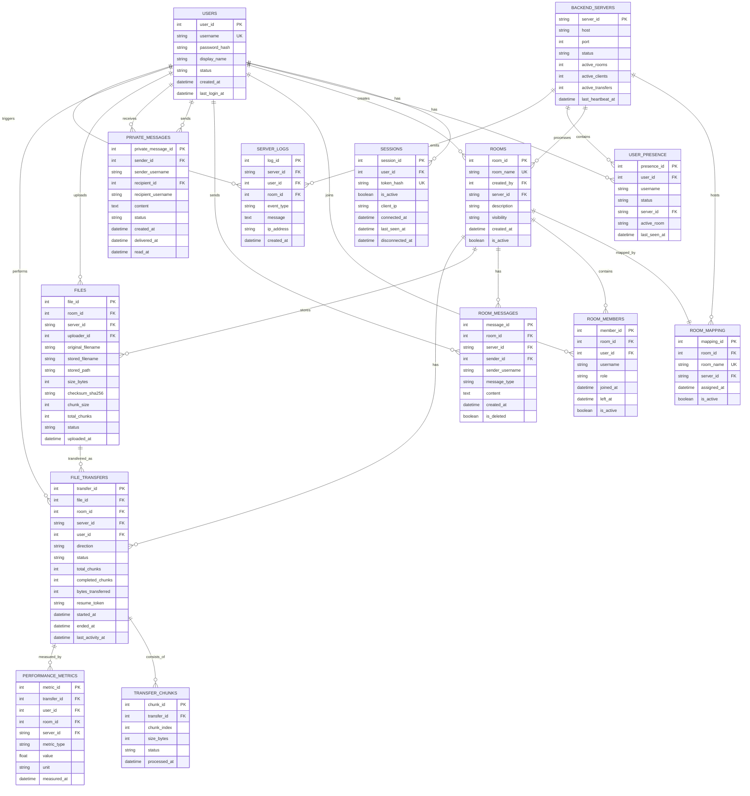

# Database Design - NetCourier

Dokumen ini mendesain database NetCourier untuk arsitektur:

```txt
Gateway/Auth/Load Balancer + Process Server S1/S2 + Central Database
```

Database pusat menyimpan data auth, room, chat history, PM history, file metadata, transfer state, log, dan metrics. File fisik tetap disimpan di file storage Process Server.

---

## 1. ERD



---

## 2. Table Definitions

## 2.1 users

Menyimpan akun user.

| Column | Type | Constraint | Description |
|---|---|---|---|
| user_id | INTEGER | PK, auto increment | ID user |
| username | VARCHAR(50) | UNIQUE, NOT NULL | Username login |
| password_hash | TEXT | NOT NULL | Hash password |
| display_name | VARCHAR(100) | NOT NULL | Nama tampilan |
| status | VARCHAR(20) | NOT NULL | active/banned |
| created_at | DATETIME | NOT NULL | Waktu register |
| last_login_at | DATETIME | NULL | Login terakhir |

Rules:
- Username unik.
- Password tidak boleh plain text.

---

## 2.2 sessions

Menyimpan session login Gateway.

| Column | Type | Constraint | Description |
|---|---|---|---|
| session_id | INTEGER | PK | ID session |
| user_id | INTEGER | FK users.user_id | Pemilik session |
| token_hash | TEXT | UNIQUE, NOT NULL | Hash session token |
| is_active | BOOLEAN | NOT NULL | Status session |
| client_ip | VARCHAR(50) | NULL | IP client |
| connected_at | DATETIME | NOT NULL | Waktu login/connect |
| last_seen_at | DATETIME | NOT NULL | Aktivitas terakhir |
| disconnected_at | DATETIME | NULL | Waktu disconnect/logout |

Rules:
- Token asli tidak perlu disimpan, cukup hash token.
- Session nonaktif tidak boleh dipakai.

---

## 2.3 backend_servers

Menyimpan daftar Process Server.

| Column | Type | Constraint | Description |
|---|---|---|---|
| server_id | VARCHAR(20) | PK | S1/S2 |
| host | VARCHAR(100) | NOT NULL | Host/IP |
| port | INTEGER | NOT NULL | Port client-facing |
| status | VARCHAR(20) | NOT NULL | alive/down |
| active_rooms | INTEGER | NOT NULL | Jumlah room aktif |
| active_clients | INTEGER | NOT NULL | Jumlah client aktif |
| active_transfers | INTEGER | NOT NULL | Transfer aktif |
| last_heartbeat_at | DATETIME | NULL | Heartbeat terakhir |

---

## 2.4 user_presence

Menyimpan presence global user.

| Column | Type | Constraint | Description |
|---|---|---|---|
| presence_id | INTEGER | PK | ID presence |
| user_id | INTEGER | FK users.user_id, UNIQUE | User |
| username | VARCHAR(50) | NOT NULL | Username copy |
| status | VARCHAR(20) | NOT NULL | waiting/in_room/offline |
| server_id | VARCHAR(20) | FK backend_servers.server_id, NULL | Server aktif jika in_room |
| active_room | VARCHAR(100) | NULL | Nama room aktif |
| last_seen_at | DATETIME | NOT NULL | Aktivitas terakhir |

---

## 2.5 rooms

Menyimpan room.

| Column | Type | Constraint | Description |
|---|---|---|---|
| room_id | INTEGER | PK | ID room |
| room_name | VARCHAR(100) | UNIQUE, NOT NULL | Nama room |
| created_by | INTEGER | FK users.user_id | Creator |
| server_id | VARCHAR(20) | FK backend_servers.server_id | Server pemilik room |
| description | TEXT | NULL | Deskripsi |
| visibility | VARCHAR(20) | NOT NULL | public/private |
| created_at | DATETIME | NOT NULL | Waktu dibuat |
| is_active | BOOLEAN | NOT NULL | Status aktif |

---

## 2.6 room_mapping

Mapping room ke server.

| Column | Type | Constraint | Description |
|---|---|---|---|
| mapping_id | INTEGER | PK | ID mapping |
| room_id | INTEGER | FK rooms.room_id, UNIQUE | Room |
| room_name | VARCHAR(100) | UNIQUE, NOT NULL | Nama room |
| server_id | VARCHAR(20) | FK backend_servers.server_id | Server pemilik |
| assigned_at | DATETIME | NOT NULL | Waktu assign |
| is_active | BOOLEAN | NOT NULL | Mapping aktif |

Rules:
- Satu room hanya boleh punya satu mapping aktif.

---

## 2.7 room_members

Menyimpan membership room.

| Column | Type | Constraint | Description |
|---|---|---|---|
| member_id | INTEGER | PK | ID member |
| room_id | INTEGER | FK rooms.room_id | Room |
| user_id | INTEGER | FK users.user_id | User |
| username | VARCHAR(50) | NOT NULL | Username copy |
| role | VARCHAR(20) | NOT NULL | admin/member |
| joined_at | DATETIME | NOT NULL | Waktu join |
| left_at | DATETIME | NULL | Waktu leave |
| is_active | BOOLEAN | NOT NULL | Sedang aktif di room |

---

## 2.8 room_messages

Menyimpan room chat history.

| Column | Type | Constraint | Description |
|---|---|---|---|
| message_id | INTEGER | PK | ID pesan |
| room_id | INTEGER | FK rooms.room_id | Room |
| server_id | VARCHAR(20) | FK backend_servers.server_id | Server pemroses |
| sender_id | INTEGER | FK users.user_id, NULL | Sender |
| sender_username | VARCHAR(50) | NULL | Username sender |
| message_type | VARCHAR(20) | NOT NULL | text/system/file_event |
| content | TEXT | NOT NULL | Isi pesan |
| created_at | DATETIME | NOT NULL | Timestamp |
| is_deleted | BOOLEAN | NOT NULL | Soft delete |

Rules:
- `sender_id` boleh NULL untuk system message.
- Pesan tidak dihapus permanen, gunakan soft delete.

---

## 2.9 private_messages

Menyimpan PM global.

| Column | Type | Constraint | Description |
|---|---|---|---|
| private_message_id | INTEGER | PK | ID PM |
| sender_id | INTEGER | FK users.user_id | Sender |
| sender_username | VARCHAR(50) | NOT NULL | Username sender |
| recipient_id | INTEGER | FK users.user_id | Recipient |
| recipient_username | VARCHAR(50) | NOT NULL | Username recipient |
| content | TEXT | NOT NULL | Isi pesan |
| status | VARCHAR(20) | NOT NULL | sent/delivered/stored_offline/read/failed |
| created_at | DATETIME | NOT NULL | Waktu kirim |
| delivered_at | DATETIME | NULL | Waktu delivered |
| read_at | DATETIME | NULL | Waktu dibaca |

Rules:
- PM disimpan oleh Gateway.
- PM dapat diterima user yang sedang waiting maupun in_room.

---

## 2.10 files

Menyimpan metadata file.

| Column | Type | Constraint | Description |
|---|---|---|---|
| file_id | INTEGER | PK | ID file |
| room_id | INTEGER | FK rooms.room_id | Room |
| server_id | VARCHAR(20) | FK backend_servers.server_id | Server storage |
| uploader_id | INTEGER | FK users.user_id | Uploader |
| original_filename | VARCHAR(255) | NOT NULL | Nama asli |
| stored_filename | VARCHAR(255) | NOT NULL | Nama di server |
| stored_path | TEXT | NOT NULL | Path file |
| size_bytes | INTEGER | NOT NULL | Ukuran |
| checksum_sha256 | TEXT | NOT NULL | SHA-256 |
| chunk_size | INTEGER | NOT NULL | Chunk size |
| total_chunks | INTEGER | NOT NULL | Total chunk |
| status | VARCHAR(20) | NOT NULL | uploading/available/corrupted/deleted |
| uploaded_at | DATETIME | NOT NULL | Waktu upload |

---

## 2.11 file_transfers

Menyimpan state upload/download.

| Column | Type | Constraint | Description |
|---|---|---|---|
| transfer_id | INTEGER | PK | ID transfer |
| file_id | INTEGER | FK files.file_id, NULL | File |
| room_id | INTEGER | FK rooms.room_id | Room |
| server_id | VARCHAR(20) | FK backend_servers.server_id | Server |
| user_id | INTEGER | FK users.user_id | User |
| direction | VARCHAR(20) | NOT NULL | upload/download |
| status | VARCHAR(20) | NOT NULL | pending/in_progress/completed/interrupted/failed |
| total_chunks | INTEGER | NOT NULL | Total chunk |
| completed_chunks | INTEGER | NOT NULL | Chunk selesai |
| bytes_transferred | INTEGER | NOT NULL | Bytes |
| resume_token | TEXT | UNIQUE, NULL | Token resume |
| started_at | DATETIME | NOT NULL | Start |
| ended_at | DATETIME | NULL | End |
| last_activity_at | DATETIME | NOT NULL | Last activity |

---

## 2.12 transfer_chunks

Menyimpan status chunk.

| Column | Type | Constraint | Description |
|---|---|---|---|
| chunk_id | INTEGER | PK | ID chunk |
| transfer_id | INTEGER | FK file_transfers.transfer_id | Transfer |
| chunk_index | INTEGER | NOT NULL | Index chunk |
| size_bytes | INTEGER | NOT NULL | Ukuran chunk |
| status | VARCHAR(20) | NOT NULL | pending/received/sent/failed |
| processed_at | DATETIME | NULL | Waktu diproses |

Constraint:
- UNIQUE(transfer_id, chunk_index)

---

## 2.13 server_logs

Menyimpan log.

| Column | Type | Constraint | Description |
|---|---|---|---|
| log_id | INTEGER | PK | ID log |
| server_id | VARCHAR(20) | FK backend_servers.server_id, NULL | Server |
| user_id | INTEGER | FK users.user_id, NULL | User terkait |
| room_id | INTEGER | FK rooms.room_id, NULL | Room terkait |
| event_type | VARCHAR(50) | NOT NULL | Jenis event |
| message | TEXT | NOT NULL | Pesan log |
| ip_address | VARCHAR(50) | NULL | IP client |
| created_at | DATETIME | NOT NULL | Waktu log |

---

## 2.14 performance_metrics

Menyimpan hasil pengujian.

| Column | Type | Constraint | Description |
|---|---|---|---|
| metric_id | INTEGER | PK | ID metric |
| transfer_id | INTEGER | FK file_transfers.transfer_id, NULL | Transfer |
| user_id | INTEGER | FK users.user_id, NULL | User |
| room_id | INTEGER | FK rooms.room_id, NULL | Room |
| server_id | VARCHAR(20) | FK backend_servers.server_id, NULL | Server |
| metric_type | VARCHAR(50) | NOT NULL | latency/throughput/error_rate |
| value | REAL | NOT NULL | Nilai |
| unit | VARCHAR(20) | NOT NULL | ms/KBps/MBps/percent |
| measured_at | DATETIME | NOT NULL | Waktu ukur |

---

## 3. SQLite-Compatible DDL

```sql
CREATE TABLE users (
    user_id INTEGER PRIMARY KEY AUTOINCREMENT,
    username VARCHAR(50) NOT NULL UNIQUE,
    password_hash TEXT NOT NULL,
    display_name VARCHAR(100) NOT NULL,
    status VARCHAR(20) NOT NULL DEFAULT 'active',
    created_at DATETIME NOT NULL,
    last_login_at DATETIME
);

CREATE TABLE sessions (
    session_id INTEGER PRIMARY KEY AUTOINCREMENT,
    user_id INTEGER NOT NULL,
    token_hash TEXT NOT NULL UNIQUE,
    is_active BOOLEAN NOT NULL DEFAULT 1,
    client_ip VARCHAR(50),
    connected_at DATETIME NOT NULL,
    last_seen_at DATETIME NOT NULL,
    disconnected_at DATETIME,
    FOREIGN KEY (user_id) REFERENCES users(user_id)
);

CREATE TABLE backend_servers (
    server_id VARCHAR(20) PRIMARY KEY,
    host VARCHAR(100) NOT NULL,
    port INTEGER NOT NULL,
    status VARCHAR(20) NOT NULL DEFAULT 'alive',
    active_rooms INTEGER NOT NULL DEFAULT 0,
    active_clients INTEGER NOT NULL DEFAULT 0,
    active_transfers INTEGER NOT NULL DEFAULT 0,
    last_heartbeat_at DATETIME
);

CREATE TABLE user_presence (
    presence_id INTEGER PRIMARY KEY AUTOINCREMENT,
    user_id INTEGER NOT NULL UNIQUE,
    username VARCHAR(50) NOT NULL,
    status VARCHAR(20) NOT NULL DEFAULT 'offline',
    server_id VARCHAR(20),
    active_room VARCHAR(100),
    last_seen_at DATETIME NOT NULL,
    FOREIGN KEY (user_id) REFERENCES users(user_id),
    FOREIGN KEY (server_id) REFERENCES backend_servers(server_id)
);

CREATE TABLE rooms (
    room_id INTEGER PRIMARY KEY AUTOINCREMENT,
    room_name VARCHAR(100) NOT NULL UNIQUE,
    created_by INTEGER NOT NULL,
    server_id VARCHAR(20) NOT NULL,
    description TEXT,
    visibility VARCHAR(20) NOT NULL DEFAULT 'public',
    created_at DATETIME NOT NULL,
    is_active BOOLEAN NOT NULL DEFAULT 1,
    FOREIGN KEY (created_by) REFERENCES users(user_id),
    FOREIGN KEY (server_id) REFERENCES backend_servers(server_id)
);

CREATE TABLE room_mapping (
    mapping_id INTEGER PRIMARY KEY AUTOINCREMENT,
    room_id INTEGER NOT NULL UNIQUE,
    room_name VARCHAR(100) NOT NULL UNIQUE,
    server_id VARCHAR(20) NOT NULL,
    assigned_at DATETIME NOT NULL,
    is_active BOOLEAN NOT NULL DEFAULT 1,
    FOREIGN KEY (room_id) REFERENCES rooms(room_id),
    FOREIGN KEY (server_id) REFERENCES backend_servers(server_id)
);

CREATE TABLE room_members (
    member_id INTEGER PRIMARY KEY AUTOINCREMENT,
    room_id INTEGER NOT NULL,
    user_id INTEGER NOT NULL,
    username VARCHAR(50) NOT NULL,
    role VARCHAR(20) NOT NULL DEFAULT 'member',
    joined_at DATETIME NOT NULL,
    left_at DATETIME,
    is_active BOOLEAN NOT NULL DEFAULT 1,
    FOREIGN KEY (room_id) REFERENCES rooms(room_id),
    FOREIGN KEY (user_id) REFERENCES users(user_id)
);

CREATE TABLE room_messages (
    message_id INTEGER PRIMARY KEY AUTOINCREMENT,
    room_id INTEGER NOT NULL,
    server_id VARCHAR(20) NOT NULL,
    sender_id INTEGER,
    sender_username VARCHAR(50),
    message_type VARCHAR(20) NOT NULL DEFAULT 'text',
    content TEXT NOT NULL,
    created_at DATETIME NOT NULL,
    is_deleted BOOLEAN NOT NULL DEFAULT 0,
    FOREIGN KEY (room_id) REFERENCES rooms(room_id),
    FOREIGN KEY (server_id) REFERENCES backend_servers(server_id),
    FOREIGN KEY (sender_id) REFERENCES users(user_id)
);

CREATE TABLE private_messages (
    private_message_id INTEGER PRIMARY KEY AUTOINCREMENT,
    sender_id INTEGER NOT NULL,
    sender_username VARCHAR(50) NOT NULL,
    recipient_id INTEGER NOT NULL,
    recipient_username VARCHAR(50) NOT NULL,
    content TEXT NOT NULL,
    status VARCHAR(20) NOT NULL DEFAULT 'sent',
    created_at DATETIME NOT NULL,
    delivered_at DATETIME,
    read_at DATETIME,
    FOREIGN KEY (sender_id) REFERENCES users(user_id),
    FOREIGN KEY (recipient_id) REFERENCES users(user_id)
);

CREATE TABLE files (
    file_id INTEGER PRIMARY KEY AUTOINCREMENT,
    room_id INTEGER NOT NULL,
    server_id VARCHAR(20) NOT NULL,
    uploader_id INTEGER NOT NULL,
    original_filename VARCHAR(255) NOT NULL,
    stored_filename VARCHAR(255) NOT NULL,
    stored_path TEXT NOT NULL,
    size_bytes INTEGER NOT NULL,
    checksum_sha256 TEXT NOT NULL,
    chunk_size INTEGER NOT NULL,
    total_chunks INTEGER NOT NULL,
    status VARCHAR(20) NOT NULL DEFAULT 'uploading',
    uploaded_at DATETIME NOT NULL,
    FOREIGN KEY (room_id) REFERENCES rooms(room_id),
    FOREIGN KEY (server_id) REFERENCES backend_servers(server_id),
    FOREIGN KEY (uploader_id) REFERENCES users(user_id)
);

CREATE TABLE file_transfers (
    transfer_id INTEGER PRIMARY KEY AUTOINCREMENT,
    file_id INTEGER,
    room_id INTEGER NOT NULL,
    server_id VARCHAR(20) NOT NULL,
    user_id INTEGER NOT NULL,
    direction VARCHAR(20) NOT NULL,
    status VARCHAR(20) NOT NULL DEFAULT 'pending',
    total_chunks INTEGER NOT NULL,
    completed_chunks INTEGER NOT NULL DEFAULT 0,
    bytes_transferred INTEGER NOT NULL DEFAULT 0,
    resume_token TEXT UNIQUE,
    started_at DATETIME NOT NULL,
    ended_at DATETIME,
    last_activity_at DATETIME NOT NULL,
    FOREIGN KEY (file_id) REFERENCES files(file_id),
    FOREIGN KEY (room_id) REFERENCES rooms(room_id),
    FOREIGN KEY (server_id) REFERENCES backend_servers(server_id),
    FOREIGN KEY (user_id) REFERENCES users(user_id)
);

CREATE TABLE transfer_chunks (
    chunk_id INTEGER PRIMARY KEY AUTOINCREMENT,
    transfer_id INTEGER NOT NULL,
    chunk_index INTEGER NOT NULL,
    size_bytes INTEGER NOT NULL,
    status VARCHAR(20) NOT NULL DEFAULT 'pending',
    processed_at DATETIME,
    FOREIGN KEY (transfer_id) REFERENCES file_transfers(transfer_id),
    UNIQUE (transfer_id, chunk_index)
);

CREATE TABLE server_logs (
    log_id INTEGER PRIMARY KEY AUTOINCREMENT,
    server_id VARCHAR(20),
    user_id INTEGER,
    room_id INTEGER,
    event_type VARCHAR(50) NOT NULL,
    message TEXT NOT NULL,
    ip_address VARCHAR(50),
    created_at DATETIME NOT NULL,
    FOREIGN KEY (server_id) REFERENCES backend_servers(server_id),
    FOREIGN KEY (user_id) REFERENCES users(user_id),
    FOREIGN KEY (room_id) REFERENCES rooms(room_id)
);

CREATE TABLE performance_metrics (
    metric_id INTEGER PRIMARY KEY AUTOINCREMENT,
    transfer_id INTEGER,
    user_id INTEGER,
    room_id INTEGER,
    server_id VARCHAR(20),
    metric_type VARCHAR(50) NOT NULL,
    value REAL NOT NULL,
    unit VARCHAR(20) NOT NULL,
    measured_at DATETIME NOT NULL,
    FOREIGN KEY (transfer_id) REFERENCES file_transfers(transfer_id),
    FOREIGN KEY (user_id) REFERENCES users(user_id),
    FOREIGN KEY (room_id) REFERENCES rooms(room_id),
    FOREIGN KEY (server_id) REFERENCES backend_servers(server_id)
);
```

---

## 4. Index Recommendation

```sql
CREATE INDEX idx_sessions_user_id ON sessions(user_id);
CREATE INDEX idx_user_presence_status ON user_presence(status);
CREATE INDEX idx_rooms_server_id ON rooms(server_id);
CREATE INDEX idx_room_members_room_id ON room_members(room_id);
CREATE INDEX idx_room_messages_room_id_created_at ON room_messages(room_id, created_at);
CREATE INDEX idx_private_messages_pair ON private_messages(sender_id, recipient_id, created_at);
CREATE INDEX idx_files_room_id ON files(room_id);
CREATE INDEX idx_file_transfers_user_id ON file_transfers(user_id);
CREATE INDEX idx_transfer_chunks_transfer_id ON transfer_chunks(transfer_id);
CREATE INDEX idx_server_logs_created_at ON server_logs(created_at);
CREATE INDEX idx_metrics_type ON performance_metrics(metric_type);
```

---

## 5. Data Ownership Rules

| Data | Writer | Reader |
|---|---|---|
| users | Gateway | Gateway |
| sessions | Gateway | Gateway, Process Server via validation |
| backend_servers | Gateway/Process Server heartbeat | Gateway |
| room_mapping | Gateway | Gateway |
| user_presence | Gateway + Process Server status update | Gateway |
| private_messages | Gateway | Gateway |
| rooms | Gateway | Gateway, Process Server |
| room_members | Process Server | Process Server |
| room_messages | Process Server | Process Server |
| files | Process Server | Process Server |
| file_transfers | Process Server | Process Server |
| server_logs | Gateway and Process Server | Operator/report |
| performance_metrics | Gateway/Process Server/test script | Report |

---

## 6. Important Database Rules

1. Password must be hashed.
2. Token should be stored as hash.
3. PM history is global and stored by Gateway.
4. Room history is stored by Process Server.
5. Room must have exactly one active server mapping.
6. File physical content is not stored in database.
7. File metadata must include checksum.
8. Transfer state must support resume.
9. Use soft delete for messages and files if possible.
10. Log important events for demo and report.
