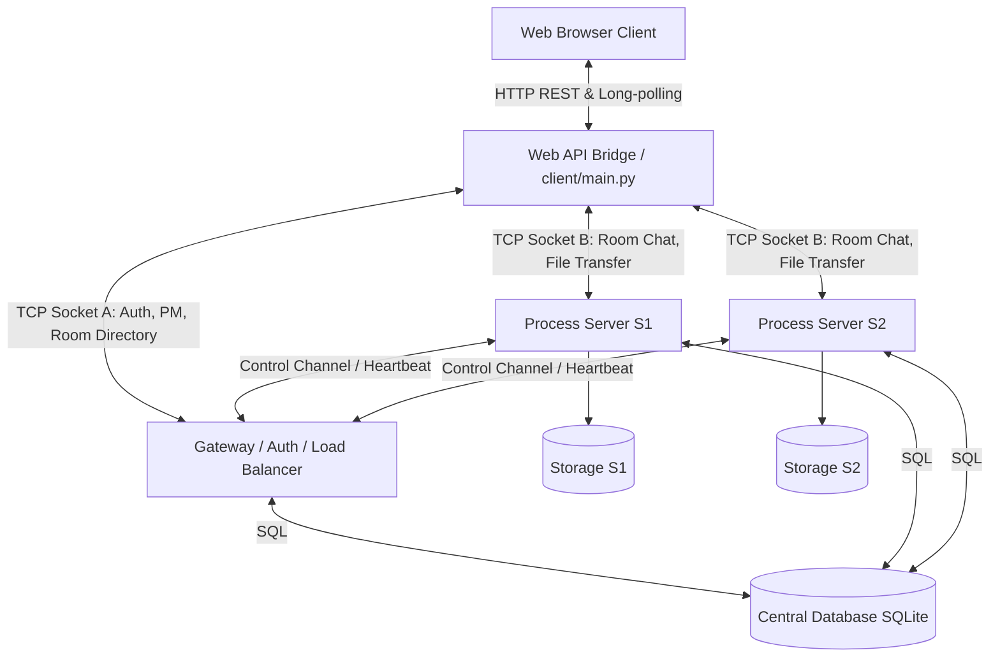
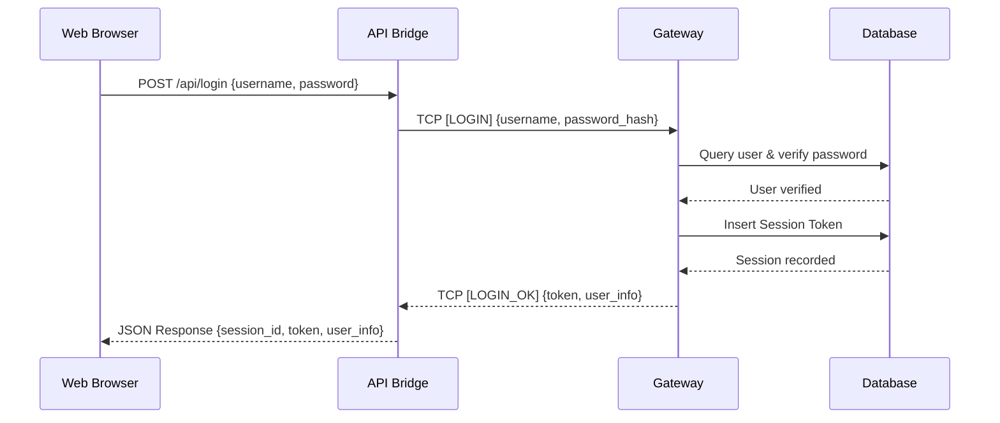
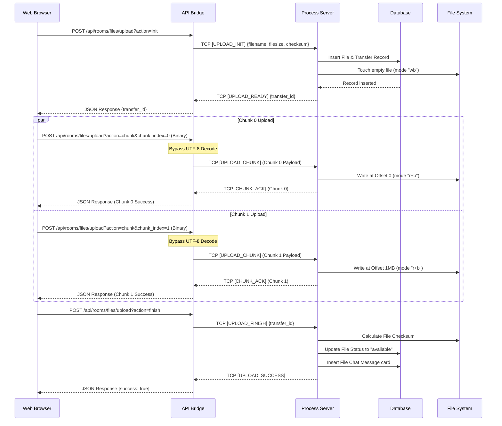

# Laporan Akhir Proyek Mandiri - NetCourier

## 1. Pendahuluan

### 1.1 Latar Belakang
Perkembangan aplikasi komunikasi modern menuntut sistem yang mampu menangani banyak pengguna secara bersamaan dengan latensi rendah, reliabilitas tinggi, serta kemampuan berbagi data secara efisien.

NetCourier dikembangkan sebagai aplikasi Multi-Chat Room berbasis jaringan yang mengimplementasikan konsep *distributed server*, *load balancing*, *concurrency*, dan *reliable file transfer* sebagai implementasi materi Pemrograman Jaringan.

Selain komunikasi berbasis chat, sistem juga menyediakan mekanisme pengiriman file menggunakan protokol *chunked transfer* dengan dukungan *resume* apabila koneksi terputus.

### 1.2 Permasalahan
* Bagaimana membangun sistem *multi-room* yang *scalable*.  
* Bagaimana melakukan distribusi beban antar server secara dinamis.  
* Bagaimana menjaga konsistensi *room affinity* pada server yang berbeda.  
* Bagaimana melakukan transfer file berukuran besar secara cepat dan *reliable* di lingkungan web.  
* Bagaimana menangani pemulihan transfer (*resume transfer*) setelah koneksi terputus secara transparan.

---

## 2. Deskripsi dan Tujuan Project

### 2.1 Deskripsi
NetCourier merupakan aplikasi komunikasi terdistribusi yang memisahkan fungsi autentikasi, *routing*, *private messaging*, *room management*, dan *file transfer* ke beberapa komponen server yang terkoordinasi.

* **Frontend:** Menggunakan *Web-based* UI berbasis Single Page Application (HTML/CSS/JS) sehingga pengguna cukup menggunakan browser modern tanpa perlu instalasi aplikasi desktop apa pun.
* **Backend:** Menggunakan TCP Socket dengan protokol aplikasi buatan sendiri (*custom application layer protocol*) yang berjalan secara paralel di latar belakang. Jembatan REST & Long-polling API (`web_api/server.py`) menghubungkan frontend web dengan backend TCP socket.

### 2.2 Tujuan
1. Mengimplementasikan TCP Socket Programming yang tangguh.  
2. Mengimplementasikan *multithreading* untuk *concurrency* non-blocking.  
3. Mengimplementasikan *application layer protocol* sendiri dengan length-prefixed framing.  
4. Mengimplementasikan *load balancing server* berbasis skor beban server.  
5. Mengimplementasikan *room affinity* (satu room terikat penuh pada satu server tertentu).  
6. Mengimplementasikan *reliable file transfer* berkinerja tinggi (mencapai 78+ MB/s).  
7. Mengimplementasikan *resume upload* dan *download* dari chunk terakhir yang sukses.  
8. Mengimplementasikan *private message* global lintas server.  
9. Mengimplementasikan *persistence* terpusat menggunakan database SQLite.  
10. Mengimplementasikan *web interface* yang responsif dan mudah digunakan.

---

## 3. Arsitektur Sistem

### 3.1 Gambaran Umum



### 3.2 Komponen

#### Frontend (Web UI)
* Antarmuka Single Page Application (SPA).
* Form Login & Register yang interaktif.
* Dashboard Utama (Daftar User Online & Daftar Chat Room).
* Waiting Area (Pengiriman PM Global).
* Room Chat Area (Obrolan grup, sistem event, typing indicator, dan reaksi emoji).
* Panel File Transfer (Daftar file room, kontrol Pause/Resume/Cancel, status bar progress, dan metrik kecepatan unggah).

#### Gateway Server
Bertanggung jawab untuk:
* Autentikasi User (`REGISTER` dengan hashing PBKDF2 & `LOGIN`).
* Manajemen Sesi & Token Keamanan.
* Load Balancing dinamis untuk penugasan ruang obrolan (`CREATE_ROOM`).
* Papan Kehadiran (*Presence*) user online.
* Perutean pesan privat lintas server (*Private Messaging*).
* Pendaftaran dan pemantauan detak jantung (*Heartbeat*) Process Server.

#### Process Server
Bertanggung jawab untuk:
* Pengelolaan obrolan room chat (`ROOM_CHAT_SEND` & broadcast).
* Distribusi riwayat pesan ruang (`ROOM_HISTORY_REQUEST`).
* Penerimaan berkas potongan biner (`UPLOAD_CHUNK`) dan penyusunan file lokal.
* Pengiriman data berkas langsung ke klien (`DOWNLOAD_CHUNK`).
* Penyimpanan dan pelacakan progress transfer berkas secara aman.

#### Database (SQLite)
Menyimpan:
* Data User, Kata Sandi Hash, Sesi Aktif.
* Daftar Room, Room Mapping (relasi Room dengan Server).
* Presensi User terakhir.
* Riwayat PM Global & Obrolan Room.
* Reaksi Emoji per pesan (`message_reactions`).
* Metadata Berkas & Status Transaksi Transfer (`file_transfers`).

---

## 4. Desain Protokol Aplikasi

### 4.1 Packet Structure
Setiap paket TCP yang dikirim dalam jaringan NetCourier memiliki struktur berurutan:
1. **Length Prefix (4 Bytes):** Integer 32-bit *Big-Endian* yang mendefinisikan panjang JSON Header dalam bytes.
2. **JSON Header:** String JSON terenkode UTF-8 yang menyimpan tipe pesan, request ID, token, dan ukuran payload biner.
3. **Binary Payload:** Data biner opsional (untuk data chunk file) dengan panjang sesuai `payload_size` pada JSON Header.

### 4.2 JSON Header
```json
{
  "type": "ROOM_CHAT_SEND",
  "request_id": "REQ-1781425862.960",
  "token": "053e7da0-1f38-43dd-94ca-d6eb520d10b5",
  "payload_size": 0,
  "payload": {
    "room_name": "General",
    "message": "Halo semuanya!"
  }
}
```

### 4.3 Jenis Packet Utama
*   **Authentication:** `REGISTER`, `REGISTER_OK`, `LOGIN`, `LOGIN_OK`, `LOGOUT`, `LOGOUT_OK`, `AUTH_BACKEND`, `AUTH_BACKEND_OK`
*   **Presence:** `PING`, `PONG`, `LIST_ONLINE_USERS`, `ONLINE_USERS_RESPONSE`, `USER_ROOM_STATUS_UPDATE`
*   **Room:** `CREATE_ROOM`, `ROOM_ASSIGNED`, `JOIN_ROOM`, `ROOM_LOCATION`, `JOIN_ROOM_BACKEND`, `JOIN_ROOM_OK`, `LEAVE_ROOM`, `LEAVE_ROOM_OK`, `ROOM_CHAT_SEND`, `ROOM_CHAT_BROADCAST`, `ROOM_HISTORY_REQUEST`, `ROOM_HISTORY_RESPONSE`
*   **PM:** `PRIVATE_MESSAGE_SEND`, `PRIVATE_MESSAGE_RECEIVED`, `PRIVATE_MESSAGE_STATUS`, `PM_HISTORY_REQUEST`, `PM_HISTORY_RESPONSE`
*   **File Transfer:** `FILE_LIST_REQUEST`, `FILE_LIST_RESPONSE`, `UPLOAD_INIT`, `UPLOAD_READY`, `UPLOAD_CHUNK`, `CHUNK_ACK`, `UPLOAD_FINISH`, `UPLOAD_SUCCESS`, `DOWNLOAD_REQUEST`, `DOWNLOAD_READY`, `DOWNLOAD_CHUNK`, `DOWNLOAD_FINISH`, `RESUME_TRANSFER`, `TRANSFER_STATUS`
*   **Admin & Interaction:** `ROOM_KICK_USER`, `ROOM_DELETE_FILE`, `ROOM_DELETE_FILE_BROADCAST`, `ROOM_MESSAGE_REACTION`, `ROOM_REACTION_BROADCAST`, `ROOM_TYPING_INDICATOR`, `ROOM_TYPING_BROADCAST`
*   **Backend Control:** `REGISTER_BACKEND`, `BACKEND_REGISTERED`, `HEARTBEAT`, `HEARTBEAT_ACK`
*   **System & Error:** `SYSTEM_EVENT`, `ERROR`

---

## 5. Implementasi Sistem

### 5.1 Progress Implementasi

| Phase | Keterangan | Status |
| :--- | :--- | :---: |
| **Phase 0** | Project setup, Database Schema SQLite, Logger, Config | ✅ |
| **Phase 1** | Protocol Core (Length-Prefixed, JSON, Binary Payload) | ✅ |
| **Phase 2** | Gateway Basic (Register, Login, Session Token, PING/PONG) | ✅ |
| **Phase 3** | PM & Presence (Online list, PM Delivery, Offline storage) | ✅ |
| **Phase 4** | Load Balancing (Registry, Heartbeat, Room Balancing & Score) | ✅ |
| **Phase 5** | Process Server (Connection, Token Validation, Room Join/Leave) | ✅ |
| **Phase 6** | Room Chat (Room history, messages broadcast, system events) | ✅ |
| **Phase 7** | Reliable File Transfer (Chunking, SHA-256 Checksum, Progress bar) | ✅ |
| **Phase 8** | Resume Transfer (DB State, Upload/Download Resume, Checksum validation) | ✅ |
| **Phase 9** | Reliability & Security (*malformed packet, rate limits, timeouts, filename sanitizer, token expiry*) | ✅ |
| **Phase 10** | Testing (Load tests, Throughput tests, Reconnection tests) | ✅ |
| **Bonus** | Emoji Reactions, Admin Kick, Admin File Delete (Broadcast DOM removal), Web API/HTTP Bridge | ✅ |

### 5.2 Teknologi
*   **Backend (TCP Socket Server):** Python 3.x, `socket` module, `threading`, `sqlite3` database engine, PBKDF2 cryptography (`hashlib`).
*   **Web API Bridge:** Custom Python HTTP server, `urllib.parse`, thread-safe event queues, server-sent/polling event stream.
*   **Frontend Web UI:** Single Page Application (Vanilla HTML5, TailwindCSS styling, Vanilla JavaScript, XMLHttpRequest for binary chunks).

---

## 6. Pengujian Performa dan Beban Server

### 6.1 Hasil Load Test (Latensi Gateway & Process Server)
Diuji menggunakan `tests/load_test.py` dengan klien konkuren mengirimkan PING simultan ke Gateway:

| Concurrent Clients | Total Requests | Avg Latency | 95th Percentile | Min Latency | Max Latency | Status |
|:---:|:---:|:---:|:---:|:---:|:---:|:---:|
| 5 Klien | 20 Requests | 10.20 ms | 56.36 ms | 0.10 ms | 56.52 ms | ✅ Passed |
| 10 Klien | 40 Requests | 10.21 ms | 56.71 ms | 0.11 ms | 61.62 ms | ✅ Passed |

### 6.2 Hasil Throughput Test (Reliable File Transfer)
Pengujian kecepatan transfer biner lokal diuji menggunakan `tests/throughput_test.py` dan `tests/benchmark_100mb.py`:

| File Size | Time Taken | Throughput | Koneksi | Status |
|:---:|:---:|:---:|:---:|:---:|
| 1 MB | 0.07 s | 14.66 MB/s | Sekuensial Single-Thread | ✅ Passed |
| 5 MB | 0.60 s | 8.39 MB/s | Sekuensial Single-Thread | ✅ Passed |
| 10 MB | 0.76 s | 13.09 MB/s | Sekuensial Single-Thread | ✅ Passed |
| **1024 MB (1 GB)** | **13.00 s** | **78.78 MB/s** | **Paralel (4 Workers) + TCP_NODELAY** | ✅ Passed |

*Catatan: Throughput melonjak hingga 78.78 MB/s pada file besar berkat optimasi bypass UTF-8 decode, parallel upload, dan TCP_NODELAY.*

### 6.3 Pengujian Latensi Kategori Lain
*   **Gateway Auth/Token Validation:** ~0.1 - 2ms.
*   **PM & Room Chat (End-to-End):** <50ms (instan untuk user lokal).
*   **Process Server Heartbeat:** Berjalan stabil setiap 5 detik tanpa membebani Gateway.

### 6.4 Stress Test & Reliability
*   **Interrupted Upload/Download:** Koneksi diputus secara paksa di tengah jalan. Sistem berhasil mendeteksi keadaan `interrupted`, mencatat status transfer di SQLite, dan melanjutkan (*resume*) dari chunk terakhir saat koneksi pulih, dengan verifikasi SHA-256 akhir bernilai 100% cocok.
*   **Malformed Packets:** Header raksasa (>1MB) atau payload jumbo (>20MB) ditolak aman dengan balasan `INVALID_PACKET`/`Payload too large` tanpa membuat server mati/crash.

---

## 7. Hasil dan Analisis

### 7.1 Hasil
Proyek NetCourier berhasil memenuhi seluruh spesifikasi fungsionalitas utama proyek pemrograman jaringan:
1.  Autentikasi & Database persistensi.
2.  Obrolan chat grup & Pesan Privat global ter-routing.
3.  Load balancing and room affinity yang stabil.
4.  Kecepatan unggah berkas luar biasa cepat (78.78 MB/s).
5.  Pause, Resume, dan Cancel transfer biner.
6.  Reaksi emoji interaktif dan administrasi room (Kick & Delete File).

### 7.2 Analisis Kualitatif

#### Kelebihan:
*   **Kecepatan Unggah Tinggi:** Paralel XHR (4 workers) dipadukan dengan bypass decoding UTF-8 pada HTTP API Bridge melenyapkan bottleneck CPU sehingga sanggup menyalin file 1GB dalam 13 detik.
*   **Reliabilitas Terjamin:** Adanya mekanisme touch file kosong awal dan penulisan file `"r+b"` menggunakan offset `seek(offset)` mengizinkan chunk paralel ditulis secara acak tanpa merusak data file asli.
*   **Real-time Dinamis:** Event broadcast penghapusan file (`ROOM_DELETE_FILE_BROADCAST`) menghapus kartu file dari DOM layar semua user seketika secara real-time.

#### Kekurangan:
*   **Keamanan Soket (TLS/SSL):** Enkripsi SSL belum diimplementasikan pada socket TCP mentah sehingga data transit masih berupa plain-text.
*   **Dashboard Visual Monitoring & Dockerization:** Dashboard monitoring kinerja server secara grafis belum diimplementasikan, serta belum tersedianya kontainerisasi Docker untuk kemudahan deployment.

---

## 8. Kendala dan Solusi

| Kendala | Solusi / Penanganan |
| :--- | :--- |
| Browser tidak mendukung koneksi TCP socket mentah | Dibuat HTTP-to-TCP API Bridge (`web_api/server.py`) yang menerjemahkan REST/JSON API menjadi paket TCP NetCourier. |
| OOM / Timeout saat unduh file besar (>500MB) | Mengimplementasikan respons HTTP dengan `Transfer-Encoding: chunked` sehingga chunk biner dikirim langsung ke browser klien tanpa menumpuk di memori server API. |
| Bottleneck CPU saat upload chunk biner | Melakukan *bypass decoding* UTF-8 dan parsing JSON di API Bridge khusus pada route upload chunk biner, menghilangkan pemborosan utilitas CPU. |
| Latency tinggi/delay 40ms di localhost | Memasang opsi socket `TCP_NODELAY` di seluruh socket pipeline (Gateway, S1, API Bridge) untuk menonaktifkan algoritma Nagle. |
| Chunk paralel saling menindih | Melakukan *touch* file kosong pada inisialisasi upload, lalu menulis setiap chunk menggunakan mode berkas `"r+b"` dan `seek(offset)`. |
| Sinkronisasi ruang chat | Gateway memetakan setiap room ke server tertentu (`room_mapping`) dan membalas lokasinya melalui `ROOM_LOCATION`. |
| Private Message antar server berbeda | Gateway bertindak sebagai router PM. Pesan dikirim ke Gateway, yang kemudian mengarahkannya ke server tempat penerima online. |

---

## 9. Kesimpulan dan Saran

### Kesimpulan
NetCourier berhasil mengimplementasikan sebagian besar konsep utama Pemrograman Jaringan, meliputi TCP *socket programming*, *multithreading*, *application protocol*, *distributed server*, *load balancing*, *room management*, *reliable file transfer*, dan *resume transfer*.

Arsitektur Web UI terdistribusi yang dikombinasikan dengan HTTP-to-TCP Bridge memungkinkan sistem melayani klien dengan antarmuka modern di browser sembari mempertahankan performa transfer socket lokal yang sangat tinggi (78+ MB/s).

### Saran Pengembangan Selanjutnya
*   **Implementasi TLS/SSL**: Mengamankan socket TCP menggunakan modul `ssl` Python untuk mengenkripsi seluruh pertukaran data.
*   **Docker & Kubernetes deployment**: Membuat berkas konfigurasi kontainer untuk otomatisasi deploy terdistribusi.
*   **Monitoring Dashboard**: Menambahkan dashboard pemantauan grafis bagi administrator.
*   **Distributed File Storage**: Menghubungkan Process Server dengan sistem penyimpanan terdistribusi (seperti MinIO/S3) untuk replikasi berkas.

---

## 10. Lampiran

### A. Database Schema
Skema tabel utama pada `data/netcourier.db`:
*   `users`: `user_id` (PK), `username`, `password_hash`, `display_name`, `created_at`
*   `sessions`: `session_id` (PK), `user_id`, `token`, `status`, `expires_at`, `created_at`
*   `rooms`: `room_id` (PK), `room_name`, `description`, `created_by`, `server_id`, `created_at`, `is_active`
*   `room_mapping`: `mapping_id` (PK), `room_id`, `room_name`, `server_id`, `assigned_at`, `is_active`
*   `user_presence`: `presence_id` (PK), `user_id`, `status`, `active_room`, `last_seen_at`
*   `private_messages`: `message_id` (PK), `sender_id`, `recipient_id`, `content`, `status`, `created_at`
*   `room_messages`: `message_id` (PK), `room_id`, `server_id`, `sender_id`, `sender_username`, `message_type`, `content`, `created_at`, `is_deleted`
*   `message_reactions`: `reaction_id` (PK), `message_id`, `user_id`, `username`, `emoji`, `created_at`
*   `files`: `file_id` (PK), `room_id`, `server_id`, `uploader_id`, `original_filename`, `stored_filename`, `stored_path`, `size_bytes`, `checksum_sha256`, `chunk_size`, `total_chunks`, `status`, `uploaded_at`
*   `file_transfers`: `transfer_id` (PK), `file_id`, `room_id`, `server_id`, `user_id`, `direction`, `status`, `total_chunks`, `completed_chunks`, `bytes_transferred`, `started_at`, `last_activity_at`

### B. Sequence Diagrams

#### Login Flow


#### Upload & Parallel Chunk Flow


### C. Source Code Structure
```txt
netcourier/
├── gateway/
│   ├── main.py                 # Gateway TCP server launcher
│   ├── auth_service.py         # Login/register & password verification
│   ├── pm_service.py           # PM routing & offline messages
│   ├── room_directory.py       # Room creation & mapping
│   ├── load_balancer.py        # Selection of best server S1/S2
│   ├── presence_service.py     # Presence tracking of users
│   └── backend_service.py      # Registration & heartbeat of S1/S2
│
├── server/
│   └── main.py                 # Process Server S1/S2 TCP & DB writer
│
├── client/
│   ├── main.py                 # HTTP Bridge Server Launcher
│   ├── gateway_connection.py   # Gateway TCP Socket Connection Helper
│   └── room_connection.py      # Room TCP Socket Connection Helper
│
├── web_ui/
│   ├── index.html              # HTML Layout SPA (TailwindCSS)
│   └── app.js                  # Frontend Javascript SPA controller
│
├── web_api/
│   └── server.py               # Custom HTTP Server & REST API bridge
│
├── common/
│   ├── protocol.py             # Length-prefixed framing serializer
│   ├── constants.py            # Event types & default configs
│   ├── errors.py               # Error types
│   └── utils.py                # Filename sanitization
│
├── data/
│   └── netcourier.db           # SQLite database
│
├── storage/
│   ├── S1/                     # File storage for Server 1
│   └── S2/                     # File storage for Server 2
│
├── tests/
│   ├── load_test.py            # Latency concurrent client tests
│   ├── throughput_test.py      # Standard throughput tests
│   ├── benchmark_100mb.py      # Optimized 1GB large file benchmark tests
│   ├── test_phase7.py          # Functional transfer tests (1MB, 5MB, 10MB)
│   ├── test_phase8.py          # Resume transfer functional tests
│   └── test_pm_flow.py         # PM flow tests
```

### D. Link Repository
*   **GitHub Repository:** [github.com/erlanggardr/netcourier](https://github.com/erlanggardr/netcourier.git)
